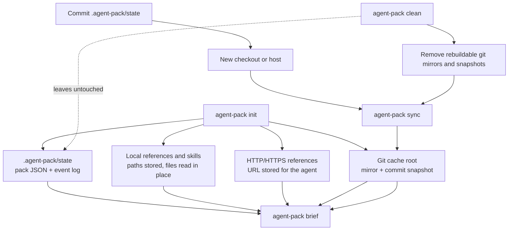

# agent-pack

`agent-pack` saves your tasks, references, instructions, and progress to disk, then renders a brief for a coding agent to read. It is for developers using an LLM coding CLI or editor agent who want work to survive beyond one chat thread.

`agent-pack` does not run the agent. It prepares the work, renders the agent-facing brief, and records task progress while you run your agent CLI separately.

A minimal handoff looks like this:

```bash
agent-pack init \
  --manifest ./examples/demo.yaml \
  "Run the demo task and record evidence."

export AGENT_PACK_ID=<generated-id>
agent-pack brief
```

Then paste a handoff like this into your agent CLI:

```text
AGENT_PACK_ID is <generated-id>. Run agent-pack brief and work the pack. Update task status as you go.
```

## Why Use It

Without `agent-pack`, the typical handoff is a long prompt or chat thread. Tasks, references, and progress are not separately addressable. With `agent-pack`, the user and agent share a state file, a stable brief, and simple task commands.

Use it when you want to:

- hand an agent a structured set of tasks
- include specific docs, directories, globs, URLs, or git-backed references
- provide supplemental `SKILL.md` files with extracted descriptions
- keep task progress, notes, blockers, and completion evidence in one place
- resume work later from committed state
- avoid relying on a long chat thread as the only source of truth

## Contents

- [Installation](#installation)
- [Core Concepts](#core-concepts)
- [Quick Start](#quick-start)
- [Command Reference](#command-reference)
- [Manifests](#manifests)
- [Git Sources](#git-sources)
- [Environment Variables](#environment-variables)
- [State and Portability](#state-and-portability)
- [Reusable Examples](#reusable-examples)
- [More Documentation](#more-documentation)

## Installation

`agent-pack` is distributed as a Node CLI.

```bash
npm install -g @kcosr/agent-pack
agent-pack --help
```

Requirements:

- Node.js 20 or newer. Node.js includes `npm`; use your package manager's equivalent if you prefer `pnpm` or `yarn`.
- Git and `tar` on `PATH` for git-backed references and skills
- Git authentication for private repositories. `agent-pack` shells out to `git`, so SSH agent, credential helper, netrc, platform keychain, GitHub CLI, or configured askpass can work.

`agent-pack` works with any agent CLI or editor agent that can read a text prompt and run shell commands in your workspace. The examples use POSIX shell syntax; on Windows PowerShell, use backticks for line continuations or write commands on one line, and prefer double-quoted globs such as `"./docs/**/*.md"`.

## Core Concepts

### Pack

A pack is the durable unit of work. A pack stores a prompt, instructions, tasks, references, skills, an optional contract, task status, and notes. Alongside the pack file, `agent-pack` writes an append-only event log for state changes.

By default, pack state is stored under the current working directory. Run `agent-pack` from your repository or workspace root when you want the default state directory committed with that project:

```text
.agent-pack/state/
```

That state contains pack definitions, task status, notes, and event history. Commit it when you want a pack to travel with the repo so another checkout, host, or agent can resume it.

Git-backed source material is cached separately:

```text
$XDG_CACHE_HOME/agent-pack/
```

If `XDG_CACHE_HOME` is unset, the cache defaults to `~/.cache/agent-pack/`. If neither `XDG_CACHE_HOME` nor `HOME` is set, it falls back to `.agent-pack/cache` in the current working directory. The cache can always be rebuilt with `agent-pack sync`; locks also live under this cache root. Use `agent-pack clean` to remove rebuildable git cache material for the current state directory.

If you explicitly point `AGENT_PACK_CACHE_DIR` inside the repository, keep that cache out of git. For example, with `AGENT_PACK_CACHE_DIR=.agent-pack/cache`:

```gitignore
.agent-pack/cache/
```

If you do not want pack instances committed to the repo, either ignore all of `.agent-pack/` or point state at an external directory:

```gitignore
.agent-pack/
```

```bash
export AGENT_PACK_STATE_DIR="$HOME/.local/state/agent-pack/my-repo"
```

### Brief

The brief is the text document rendered by `agent-pack brief`. It is meant to be pasted into an agent or read by an agent from the shell.

When present, the brief renders sections in this order: prompt, instructions, contract, commands, references, skills, and tasks. `agent-pack` lists reference paths in the brief; it does not paste referenced file contents into the brief.

By default, task entries include the task body and `doneWhen` checklist. For very large task lists, set `AGENT_PACK_BRIEF_TASK_CONTENT=false` when rendering the brief to show only task status, ID, and title; the brief will tell the agent to run `agent-pack task show <task-id>` before working a task, including `--id <pack-id>` when the brief was rendered with an explicit id.

### Manifest

A manifest is a reusable YAML file that can contribute instructions, tasks, references, skills, and contract rules to a pack. Manifest parsing is strict: unknown fields fail fast instead of being ignored.

### Prompt

The optional positional prompt is a one-off instruction for this pack instance:

```bash
agent-pack init --id worker-123 "Focus first on the cache behavior."
```

It is rendered at the top of the brief. Prompts are not tasks, references, or reusable manifest content.

### Instructions

Instructions are durable guidance loaded from a manifest or a raw instructions file. They are rendered after the prompt and before the tasks.

Use instructions for reusable workflow guidance such as review standards, evidence requirements, or completion expectations.

### Tasks

Tasks are mutable work items. Each task gets an auto-generated runtime ID (`t001`, `t002`, ...). If a manifest task has its own `id`, that value is preserved as `sourceId` for traceability, but task commands use the runtime ID shown by `agent-pack task list`.

Agents update task state as they work:

```bash
export AGENT_PACK_ID=quickstart
agent-pack task list
agent-pack task start t001
agent-pack task note t001 "Read README.md."
agent-pack task done t001 --note "Recorded findings in task notes."
```

### References

References are named pointers to read-only context the agent should inspect. They can be local files, local directories, globs, HTTP/HTTPS URLs, git paths, or whole git repo snapshots.

Examples:

```text
./docs/usage.md
../some-dir
./docs/**/*.md
https://example.com/design-notes.md
git+https://github.com/org/repo.git//docs/reference.md#main
git+https://github.com/org/repo.git//docs/**/*.md#v1.2.0
git+https://github.com/org/repo.git#main
git+git@github.com:org/repo.git//docs/reference.md#main
```

Directory and whole-repo references stay as one logical reference in the brief. Glob references list the matched files. Globs match files, include dotfiles, and do not follow symlinks.

### Skills

Skills are supplemental `SKILL.md` files. `agent-pack` extracts the skill name, description, and readable path so the brief can tell the agent when a skill may be relevant.

Only files named exactly `SKILL.md` are accepted as skills:

```bash
agent-pack init --skills ./skills --add-task "Apply relevant skills to this work."
```

That command scans the directory recursively but only includes matching `SKILL.md` files. Globs such as `./skills/**` work too.

A `SKILL.md` may include YAML frontmatter with `name` and `description` fields. Other frontmatter fields are ignored. Without frontmatter, the name falls back to the first `#` heading and then the parent directory name; the description falls back to the first paragraph, capped at 300 characters.

If multiple skills resolve to the same name, `agent-pack` appends `(2)`, `(3)`, and so on in the brief. Use distinct `name` values for predictable labels.

```markdown
---
name: fresh-eyes
description: Re-read changed code and look for obvious defects.
---

# Fresh Eyes

Review the changed files again before finalizing.
```

### Contract

A contract is manifest-only guidance rendered in the brief for the agent to follow. It has `do` and `dont` string lists. If multiple manifests contribute contracts, entries are concatenated in source order.

## Quick Start

Create a pack from the demo manifest:

```bash
agent-pack init \
  --manifest ./examples/demo.yaml \
  "Run the demo task and record evidence."
```

Expected output:

```text
Created pack demo-a1b2c3
Run: agent-pack brief --id demo-a1b2c3
```

Set the generated pack id in your shell before asking an agent to work. Commands can then omit `--id`:

```bash
export AGENT_PACK_ID=demo-a1b2c3
agent-pack brief
```

`init` uses `--id` when provided, then `AGENT_PACK_ID` when set, and otherwise generates an id from the pack name plus a short random suffix.

Abbreviated output:

```text
You are working from pack demo-a1b2c3.
Name: demo

Prompt:
Run the demo task and record evidence.

Commands:
  agent-pack task list
  agent-pack task show <task-id>
  agent-pack task start <task-id>
  agent-pack task note <task-id> "evidence"
  agent-pack task done <task-id> --note "completion evidence"
  agent-pack task block <task-id> --note "blocker"
  ...

Tasks:
- [pending] t001 - Run date and record the output
```

In your agent CLI or editor agent, paste a handoff like this:

```text
AGENT_PACK_ID is demo-a1b2c3. Run agent-pack brief and work the pack. Update task status as you go.
```

Check progress:

```bash
agent-pack task list
agent-pack summary
agent-pack report
```

## Command Reference

### `init`

Create a pack.

```bash
agent-pack init [options] [prompt]
```

Common options:

| Option | Purpose |
|---|---|
| `--id <id>` | Use a specific pack ID. If omitted, `AGENT_PACK_ID` is used when set; otherwise `agent-pack` generates `<name>-<suffix>` |
| `--name <name>` | Set a display name |
| `--manifest <ref>` | Load one catalog manifest, local manifest YAML file, or git ref |
| `--manifests <ref>` | Alias for `--manifest`; useful when passing several manifests |
| `--instructions <path>` | Read a plain text or Markdown file verbatim as the pack instructions section |
| `--add-task <text>` | Add one ad hoc task |
| `--task <ref>` | Add one catalog task, local task YAML file, glob, or git ref |
| `--tasks <ref>` | Alias for `--task`; useful when passing several task sources |
| `--reference <ref>` | Add one catalog reference, local reference file, directory, glob, URL, or git ref |
| `--references <ref>` | Alias for `--reference`; useful when passing several references |
| `--skill <ref>` | Add one catalog skill, local `SKILL.md` file, directory scan, glob, or git ref |
| `--skills <ref>` | Alias for `--skill`; useful when passing several skills |
| `--git-refresh auto\|always\|never` | Control git fetching for this command |
| `--state-dir <path>` | Override the state directory for `init`; use `AGENT_PACK_STATE_DIR` for other commands |
| `--json` | Emit machine-readable output |

Example:

Illustrative only: replace the `example/...` URLs and local paths with sources that exist for your project.

```bash
agent-pack init \
  --id reviewer-001 \
  --add-task "Check local unstaged changes" \
  --manifest git+https://github.com/example/agent-packs.git//review/base.yaml#main \
  --task git+https://github.com/example/agent-packs.git//tasks/security-review.yaml#main \
  --task ./tasks/*.yaml \
  --reference git+https://github.com/example/product.git//docs/**/*.md#main \
  --reference https://example.com/design-notes.md \
  --reference git+https://github.com/example/product.git//adr#main \
  --references './docs/**/*.md' \
  --skill git+https://github.com/example/agent-skills.git//review/fresh-eyes/SKILL.md#v1.0.0 \
  --skills ./skills \
  "Use the included docs and skills to complete the review."
```

That command composes content across types: the manifest can contribute instructions, tasks, references, skills, and contract rules; task flags add more tasks; reference flags add git, URL, and local reading material; skill flags add supplemental `SKILL.md` files.

Bare refs are catalog refs loaded from the agent-pack config directory. Local filesystem paths must start with `./`, `../`, `~/`, or `/`.

For a similar pack expressed mostly as one manifest, save this YAML as `reviewer-pack.yaml`. String entries use the same ref syntax as the corresponding CLI flag; object entries add inline task content or reference/skill metadata.

```yaml
schemaVersion: 1
name: reviewer-001
instructions: Use the included docs and skills to complete the review.

tasks:
  - title: Check local unstaged changes
  - review/security
  - git+https://github.com/example/agent-packs.git//tasks/security-review.yaml#main
  - ./tasks/*.yaml

references:
  - product/api
  - name: product docs
    ref: git+https://github.com/example/product.git//docs/**/*.md#main
  - https://example.com/design-notes.md
  - name: architecture decisions
    ref: git+https://github.com/example/product.git//adr#main
  - ./docs/**/*.md

skills:
  - engineering/fresh-eyes
  - ref: git+https://github.com/example/agent-skills.git//review/fresh-eyes/SKILL.md#v1.0.0
  - ./skills
```

Then initialize with the manifest and a one-off prompt:

```bash
agent-pack init \
  --id reviewer-001 \
  --manifest ./reviewer-pack.yaml \
  "Use the included docs and skills to complete the review."
```

### `brief`

Print the agent-facing brief.

```bash
agent-pack brief --id reviewer-001
```

The brief includes the prompt, instructions, contract if defined, task commands when tasks exist, references, skills, and task list.

For long task lists, render a compact task section:

```bash
AGENT_PACK_BRIEF_TASK_CONTENT=false agent-pack brief --id reviewer-001
```

Compact briefs omit task bodies and `doneWhen` checklists, but keep task status, ID, and title. The agent can run `agent-pack task show <task-id> --id reviewer-001` for the full task detail when starting a task.

### `sync`

Fetch and unpack missing git-backed material for a pack.

```bash
agent-pack sync --id reviewer-001
agent-pack sync --id reviewer-001 --git-refresh always
agent-pack sync --id reviewer-001 --json
```

With `--json`, `sync` emits the synced pack as JSON.

`sync` is explicit. Other commands do not fetch or clone git sources. If a pack is resumed on a new host, run `sync` before `brief`:

```text
Continue work on reviewer-001. Run agent-pack sync --id reviewer-001, then agent-pack brief --id reviewer-001 and proceed.
```

`--git-refresh` applies only to `init` and `sync`:

| Value | Meaning |
|---|---|
| `auto` | Clone the mirror if missing; do not refresh existing mirrors |
| `always` | Clone if missing; otherwise run `git fetch --prune --tags` before resolving refs |
| `never` | Do not clone or fetch; fail if the mirror is missing |

With `auto`, a branch ref such as `main` continues resolving from the cached mirror until you run `agent-pack sync --git-refresh always`.

Local references and skills are not affected by `sync`; they are read from their paths when the agent uses them.

### `clean`

Remove rebuildable git cache material for packs in the current state directory.

```bash
agent-pack clean
agent-pack clean --id reviewer-001
agent-pack clean --json
```

By default, `clean` reads all packs in the current state directory and removes matching `git/<repoHash>` mirrors and `snapshots/<repoHash>` directories from the cache root. `--id` limits cleanup to one pack. Pack state, event logs, local references, HTTP/HTTPS references, and locks are not removed.

After cleaning, run `agent-pack list` to identify affected packs, then run `agent-pack sync --id <pack>` before rendering briefs for packs with git-backed material. Resync can fail if the original remote, ref, or credentials are no longer available.

The cache root is shared by default across projects for the same user account. If two state directories reference the same git repository, `agent-pack clean` in one project can remove cache material another project will need to rebuild with `sync`. Cache reads, syncs, and cleans are locked per git repository cache key so concurrent `agent-pack` processes do not remove cache material mid-operation.

With `--json`, `clean` emits `{ packIds, repoHashes, removed }`: pack IDs scanned, unique git repository cache keys targeted, and cache paths actually removed.

### `list`

List packs in the current state directory.

```bash
agent-pack list
agent-pack list --json
```

Text output is tab-separated: pack id, pack name, status, completed/total task count, and a `blocked:N` field. Use `list --json` for scripts that need to discover pack IDs.

### Task Commands

```bash
agent-pack task list --id reviewer-001
agent-pack task show t001 --id reviewer-001
agent-pack task show t001 --id reviewer-001 --json
agent-pack task start t001 --id reviewer-001 --note "Starting review."
agent-pack task note t001 --id reviewer-001 "Read the design."
agent-pack task done t001 --id reviewer-001 --note "Completed with evidence in notes."
agent-pack task block t002 --id reviewer-001 --note "Need user decision."
```

`agent-pack task show` prints a human-readable task detail by default, including status, body, `doneWhen`, and notes. Add `--json` when a script needs the task state object.

`agent-pack task note` takes the note text as a positional argument. `agent-pack task start`, `agent-pack task done`, and `agent-pack task block` take optional note text with `--note`.

### Status and Reports

```bash
agent-pack status
agent-pack status --json
agent-pack summary --id reviewer-001
agent-pack summary --id reviewer-001 --json
agent-pack report --id reviewer-001
agent-pack report --id reviewer-001 --json
```

Use `agent-pack status` to inspect resolved directories and defaults such as the config/catalog dir, state dir, cache dir, and current `AGENT_PACK_ID`.

Use `agent-pack list` to discover packs, then run `summary --id <pack>` for pack progress.

`summary` prints a concise pack progress summary by default. Add `--json` for a compact pack progress object.
`report` prints a human-readable pack report by default, including task status and notes. Add `--json` for the full saved pack state.

JSON output shapes:

| Command | JSON shape |
|---|---|
| `init --json` | `{ id, briefCommand, pack }` |
| `sync --id <id> --json` | Pack state object |
| `clean --json` | `{ packIds, repoHashes, removed }` |
| `list --json` | Array of status objects |
| `status --json` | Resolved paths and current defaults |
| `summary --json` | `{ id, name, status, tasks, references, skills }` |
| `task show <task-id> --json` | Task state object |
| `report --json` | Full pack state object |

Derived pack statuses:

| Status | Meaning |
|---|---|
| `no_tasks` | Pack has context but no tasks |
| `pending` | Pack has tasks and no work has started |
| `in_progress` | At least one task has started or completed |
| `blocked` | One or more incomplete tasks are blocked |
| `completed` | All tasks are completed |

### Exit Codes

`agent-pack` exits `0` on success and `1` for user-visible errors such as validation failures, missing packs, missing files, and git failures. Error messages are printed to stderr.

## Catalog

Catalog refs are reusable named pack inputs stored under the agent-pack config directory:

```text
$AGENT_PACK_CONFIG_DIR/
  manifests/review/code-review.yaml
  tasks/review/security.yaml
  references/product/api.yaml
  skills/engineering/fresh-eyes/SKILL.md
```

If `AGENT_PACK_CONFIG_DIR` is unset, the config directory is `$XDG_CONFIG_HOME/agent-pack`, or `~/.config/agent-pack` when `XDG_CONFIG_HOME` is unset, or `.agent-pack/config` in the current working directory when neither `XDG_CONFIG_HOME` nor `HOME` is set.

Use catalog refs by name, without file extensions:

```bash
agent-pack init \
  --manifest review/code-review \
  --task review/security \
  --reference product/api \
  --skill engineering/fresh-eyes
```

Catalog names may contain subdirectories, letters, numbers, `_`, and `-`. A catalog ref such as `review/code-review` is resolved by type:

| Input | Resolved path |
|---|---|
| `--manifest review/code-review` | `manifests/review/code-review.yaml` |
| `--task review/security` | `tasks/review/security.yaml` |
| `--reference product/api` | `references/product/api.yaml` |
| `--skill engineering/fresh-eyes` | `skills/engineering/fresh-eyes/SKILL.md` |

Local paths are explicit. Use `./review/code-review.yaml`, `../review/code-review.yaml`, `~/packs/review.yaml`, or `/absolute/path.yaml` when reading from the filesystem. Bare refs inside manifests use the catalog too; they do not resolve relative to the manifest file.

Catalog reference files define a reference alias:

```yaml
name: product api
description: API docs for the current repository.
ref: ./docs/api.md
```

Inspect installed catalog entries:

```bash
agent-pack catalog list
agent-pack catalog list --type manifest
agent-pack catalog show manifest review/code-review
agent-pack catalog path skill engineering/fresh-eyes
```

### `catalog`

List and inspect catalog entries.

```bash
agent-pack catalog list
agent-pack catalog list --type task
agent-pack catalog list --json
agent-pack catalog show manifest review/code-review
agent-pack catalog path task review/security
```

Text `catalog list` output is tab-separated: type, catalog name, and absolute path. `catalog list` creates the catalog directories when they do not exist.

Installed npm packages include sample manifests in their `examples/` directory. `agent-pack --help` prints the installed examples path. Copy any examples you want to reuse by bare catalog name into the catalog `manifests/` directory:

```bash
EXAMPLES_DIR="$(agent-pack --help | awk '$1 == "Examples" {print $2}')"
CATALOG_DIR="$(agent-pack status --json | node -e 'console.log(JSON.parse(require("fs").readFileSync(0, "utf8")).configDir)')"

mkdir -p "$CATALOG_DIR/manifests"
cp "$EXAMPLES_DIR"/*.yaml "$CATALOG_DIR/manifests/"

agent-pack init --manifest code-review "Review scope: unstaged changes."
```

## Manifests

Manifests are YAML files that define reusable pack content. A manifest ref can be a catalog name, a local file, or a git file ref:

```bash
agent-pack init --manifest review/code-review
agent-pack init --manifest ./pack.yaml
agent-pack init --manifests git+https://github.com/org/packs.git//review.yaml#main
```

Treat remote manifests as trusted inputs. A manifest can reference any local path readable by the user running `agent-pack`, plus arbitrary HTTP/HTTPS URLs that the agent may fetch from the host's network. A malicious manifest could direct the agent to inspect sensitive local files or call internal endpoints reachable from the agent. Only load manifests from sources you trust.

Manifest parsing is strict. Unknown fields are rejected.

| Location | Allowed fields |
|---|---|
| Manifest | `schemaVersion`, `name`, `instructions`, `tasks`, `references`, `skills`, `contract` |
| Inline task object | `id`, `title`, `category`, `body`, `doneWhen` |
| Reference or skill object | `name`, `description`, `ref` |
| Contract | `do`, `dont` |

Rules:

- `schemaVersion`, when present, must be `1`.
- `tasks`, `references`, and `skills` are arrays. Each entry may be either a string ref or an object.
- A string entry in `tasks` is equivalent to `--task <ref>`.
- A string entry in `references` is equivalent to `--reference <ref>`.
- A string entry in `skills` is equivalent to `--skill <ref>`.
- Bare string refs are catalog refs. Local paths must start with `./`, `../`, `~/`, or `/`.
- Each inline task object must have `id` or `title`.
- `doneWhen`, `contract.do`, and `contract.dont` are arrays of non-empty strings.
- Reference and skill object `ref` values are non-empty strings.
- `contract` must include at least one `do` or `dont` entry.
- Manifest task `id` is preserved as `sourceId`; task commands use the runtime ID (`t001`, `t002`, ...) shown by `agent-pack task list`.
- `category` is stored as task metadata but is not currently rendered in the brief.

### Task Files

`--task` and `--tasks` load standalone YAML task files. Task objects use these fields: `id`, `title`, `category`, `body`, and `doneWhen`.

A task file may contain one task object:

```yaml
id: inspect
title: Inspect implementation
body: Read the changed files and record concrete findings.
doneWhen:
  - Notes cite inspected files.
```

It may contain an array of task objects:

```yaml
- id: inspect
  title: Inspect implementation
- id: summarize
  title: Summarize findings
```

Or it may contain a `tasks` wrapper:

```yaml
tasks:
  - id: inspect
    title: Inspect implementation
```

```yaml
schemaVersion: 1
name: implementation-review
instructions: |
  Review references before starting tasks.
  Update task notes with concrete evidence.

tasks:
  - ./tasks/preflight.yaml
  - ./tasks/review/*.yaml
  - id: inspect
    title: Inspect implementation
    body: Check the implementation against the included design.
    doneWhen:
      - Notes identify files inspected.
      - Findings are recorded or the task says no issues found.

references:
  - ./docs/**/*.md
  - name: design
    description: Initial product design.
    ref: ./docs/usage.md

  - name: upstream examples
    description: Related docs from an external repository.
    ref: git+https://github.com/org/repo.git//docs/**/*.md#main

  - name: published guidance
    description: A public HTTP reference for the agent to read.
    ref: https://example.com/guidance.md

skills:
  - ref: ./skills/fresh-eyes/SKILL.md
  - ./skills/review
```

CLI flags and manifests can be combined. Merge order is deterministic and source-order based:

1. `agent-pack init` reads include flags from left to right.
2. Each include contributes content to one or more typed brief sections: instructions, tasks, references, skills, or contract.
3. The final brief still renders one section per type. Inside each section, entries keep the relative order of the sources that contributed them.
4. The positional prompt is stored as the pack-level prompt and rendered at the top of the brief. It is not part of section ordering.

Suppose this command places the ad hoc task before manifest tasks, while references and skills still render in their own sections:

```bash
agent-pack init \
  --id ordered-review \
  --add-task "Check local unstaged changes first" \
  --manifest git+https://github.com/example/agent-packs.git//review/base.yaml#main \
  --task ./tasks/follow-up.yaml \
  --reference git+https://github.com/example/product.git//docs/api.md#main \
  --reference ./notes.md \
  --skill git+https://github.com/example/agent-skills.git//review/fresh-eyes/SKILL.md#v1.0.0
```

The task section renders the ad hoc task, then tasks from the remote manifest, then tasks from `./tasks/follow-up.yaml`. The reference section renders references from the remote manifest before the remote API doc and `./notes.md` because the manifest appeared first among reference-contributing sources. Skills from the manifest render before the explicit remote skill for the same reason.

## Git Sources

Git source syntax:

```text
git+<repo-url>//<path-inside-repo>#<ref>
git+<repo-url>#<ref>
```

The `#<ref>` suffix is optional. If omitted, `agent-pack` uses the remote default branch, resolves it to a commit, and records the resolved commit in source metadata.

Supported URL forms:

```text
git+https://github.com/org/repo.git//docs/usage.md#main
git+http://git.example.com/org/repo.git//docs/usage.md#main
git+ssh://git@github.com/org/repo.git//docs/usage.md#main
git+git@github.com:org/repo.git//docs/usage.md#main
git+file:///path/to/repo.git//docs/usage.md#main
git+git://git.example.com/org/repo.git//docs/usage.md#main
```

Authentication is delegated to normal `git` behavior: SSH agent, credential helper, netrc, platform keychain, or configured askpass.

## Environment Variables

| Variable | Purpose | Default |
|---|---|---|
| `AGENT_PACK_ID` | Default pack target | unset |
| `AGENT_PACK_CONFIG_DIR` | Catalog config directory | `$XDG_CONFIG_HOME/agent-pack`, or `~/.config/agent-pack` when `XDG_CONFIG_HOME` is unset, or `<cwd>/.agent-pack/config` when neither `XDG_CONFIG_HOME` nor `HOME` is set |
| `AGENT_PACK_STATE_DIR` | Pack state directory | `<cwd>/.agent-pack/state` |
| `AGENT_PACK_CACHE_DIR` | Cache root | `$XDG_CACHE_HOME/agent-pack`, or `~/.cache/agent-pack` when `XDG_CACHE_HOME` is unset, or `<cwd>/.agent-pack/cache` when neither `XDG_CACHE_HOME` nor `HOME` is set |
| `AGENT_PACK_GIT_REFRESH` | Default git fetch policy for `init` and `sync` | `auto` |
| `AGENT_PACK_CMD` | Command name rendered in brief task commands; set when invoking through a wrapper | `agent-pack` |
| `AGENT_PACK_BRIEF_TASK_CONTENT` | Include task body and `doneWhen` checklist in rendered briefs; set to `false` to render only task status, ID, and title | `true` |

Relative path values resolve from the current working directory. Bare refs for manifests, tasks, references, and skills resolve from the catalog config directory.

Set a default pack ID when working on one pack for a while. This is the recommended handoff shape before launching an agent CLI from the same shell:

```bash
export AGENT_PACK_ID=reviewer-001

agent-pack brief
agent-pack summary
agent-pack task done t001 --note "Completed."
```

If the agent starts in a different shell, include the pack id in the handoff:

```text
AGENT_PACK_ID is reviewer-001. Run agent-pack brief, then work the pack.
```

## State and Portability

Default layout:

```text
.agent-pack/
  state/
    index.json
    packs/
      reviewer-001.json
    events/
      reviewer-001.jsonl

<cache root>/
  git/
  snapshots/
  locks/
```



Pack state is the durable handoff; git cache material is rebuildable with `sync`, while local files and URLs remain external context.

The cache root is `AGENT_PACK_CACHE_DIR` when set, otherwise `$XDG_CACHE_HOME/agent-pack`, `~/.cache/agent-pack`, or `.agent-pack/cache` in the current working directory if neither `XDG_CACHE_HOME` nor `HOME` is set.

Choose one of two common state policies.

### Commit Pack State

Use this when pack instances are part of the repo workflow and should be resumable by another checkout or agent:

```bash
git add .agent-pack/state
git commit -m "Add agent pack state"
```

On the new host:

```bash
agent-pack sync --id reviewer-001
agent-pack brief --id reviewer-001
```

Recommended `.gitignore`:

```gitignore
# Only needed if AGENT_PACK_CACHE_DIR is pointed inside the repo.
.agent-pack/cache/
```

### Keep Pack State Local

Use this when pack instances are personal scratch state and should not appear in repo history.

Option 1: ignore the whole default directory:

```gitignore
.agent-pack/
```

Option 2: store state outside the repo:

```bash
export AGENT_PACK_STATE_DIR="$HOME/.local/state/agent-pack/reviewer-001"
```

With external state, set `AGENT_PACK_ID` or pass `--id` so commands target the intended pack:

```bash
export AGENT_PACK_ID=reviewer-001
agent-pack brief
```

`agent-pack` does not snapshot local files. If a local reference or skill changes after pack creation, the agent reads the current file at that path. HTTP/HTTPS references are rendered as URLs for the agent to read. Git references resolve to a commit and read from exported snapshots. Git snapshots reject symlinks instead of extracting them into the cache.

`agent-pack clean` removes git cache directories referenced by current pack state and leaves `.agent-pack/state/` untouched. The removed cache can be rebuilt with `agent-pack sync` while the upstream git sources remain accessible.

### Event Log

Each pack has an append-only JSONL event log under `.agent-pack/state/events/<id>.jsonl`. Events are written for pack creation and task state changes such as start, note, done, and block. Commit event logs with `.agent-pack/state/` when you want the audit trail to travel with the pack.

### Locking

State mutations are serialized with lock directories under the cache root's `locks/` directory. Stale locks whose holder process is gone are recovered automatically. If a command reports a stuck lock and no `agent-pack` process is running, remove the reported lock directory.

Pack state lock filenames are prefixed with a 16-character hash of the state directory path so multiple state directories sharing the same cache root do not collide. Git cache lock filenames use the shared `cache-<repoHash>` form so cache operations for the same repository are serialized across state directories.

### Reinitializing a Pack

`agent-pack init --id <id>` fails if the pack id already exists. To recreate a scratch pack, remove `.agent-pack/state/packs/<id>.json` and `.agent-pack/state/events/<id>.jsonl`, then run `agent-pack init --id <id> ...` again. Pack listings ignore stale index entries whose pack files were removed.

## Reusable Examples

The npm package includes an `examples/` directory with reusable manifests for common workflows. Run `agent-pack --help` to see the installed examples path.

Create a code-review pack:

```bash
agent-pack init \
  --manifest ./examples/code-review.yaml \
  "Review scope: unstaged changes."

export AGENT_PACK_ID=<generated-id>
agent-pack brief
```

Create a documentation-review pack:

```bash
agent-pack init \
  --manifest ./examples/docs-review.yaml \
  "Review the repository documentation against the current code."

export AGENT_PACK_ID=<generated-id>
agent-pack brief
```

Use the generated id printed by `init`, or pass `--id <id>` when you want a deterministic pack id. Setting `AGENT_PACK_ID` before `init` also provides the pack id for that new pack.

To use examples as catalog refs, copy them into the catalog manifest directory:

```bash
EXAMPLES_DIR="$(agent-pack --help | awk '$1 == "Examples" {print $2}')"
CATALOG_DIR="$(agent-pack status --json | node -e 'console.log(JSON.parse(require("fs").readFileSync(0, "utf8")).configDir)')"

mkdir -p "$CATALOG_DIR/manifests"
cp "$EXAMPLES_DIR"/*.yaml "$CATALOG_DIR/manifests/"

agent-pack init --manifest docs-review "Review the docs."
```

## More Documentation

See [docs/usage.md](docs/usage.md) for a compact installed usage reference.
