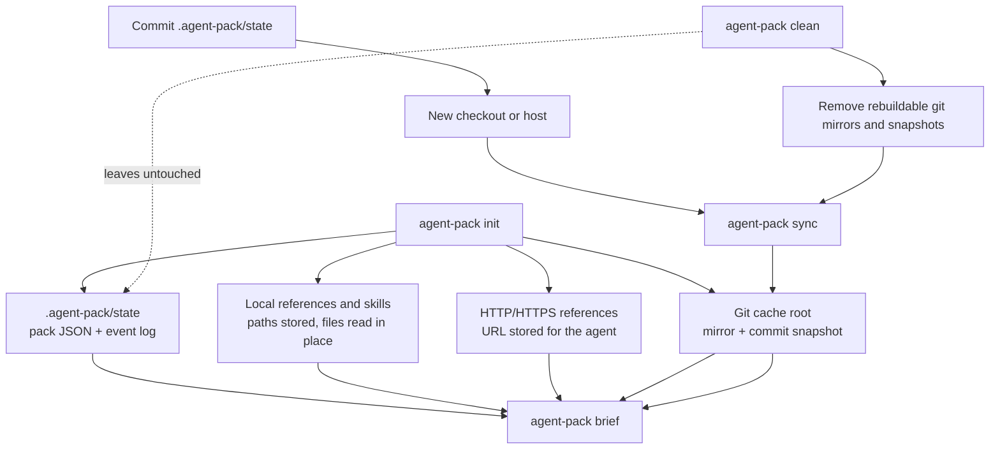

# Configuration & State

How `agent-pack` resolves directories, reads git sources, finds catalog entries, and persists pack state on disk. This page is the canonical home for environment variables, path resolution, git source syntax, the catalog layout, and the on-disk state model.

For command and flag syntax (including `catalog`, `sync`, and `clean`), see [cli.md](cli.md). For manifest, task, and agent schema, see [authoring.md](authoring.md).

## Environment Variables

| Variable | Purpose | Default |
|---|---|---|
| `AGENT_PACK_ID` | Default existing-pack target | unset |
| `AGENT_PACK_CREATE_ID` | Default ID for newly created packs (ignored by commands that target existing packs) | unset |
| `AGENT_PACK_CONFIG_DIR` | Catalog/config directory | `$XDG_CONFIG_HOME/agent-pack`, or `~/.config/agent-pack` when `XDG_CONFIG_HOME` is unset, or `<cwd>/.agent-pack/config` when neither `XDG_CONFIG_HOME` nor `HOME` is set |
| `AGENT_PACK_STATE_DIR` | Pack state directory | `<cwd>/.agent-pack/state` |
| `AGENT_PACK_CACHE_DIR` | Cache root (git mirrors, snapshots, locks) | `$XDG_CACHE_HOME/agent-pack`, or `~/.cache/agent-pack` when `XDG_CACHE_HOME` is unset, or `<cwd>/.agent-pack/cache` when neither `XDG_CACHE_HOME` nor `HOME` is set |
| `AGENT_PACK_GIT_REFRESH` | Default git fetch policy (`auto`, `always`, or `never`); an invalid value is an error | `auto` |
| `AGENT_PACK_CMD` | Command name rendered in brief task commands (set when invoking through a wrapper) | `agent-pack` |
| `AGENT_PACK_BRIEF_TASK_CONTENT` | Include task body and `doneWhen` in rendered briefs; set to `false` to render only status, ID, and title; an invalid value is a hard error | `true` |

Relative path values resolve from the current working directory. Bare refs for manifests, tasks, references, skills, and agents resolve from the catalog config directory.

`AGENT_PACK_GIT_REFRESH` supplies the default for the `--git-refresh` flag accepted by `init`, `run`, `sync`, `reference add`, and `skill add`; an invalid value is reported at startup as an error. `AGENT_PACK_BRIEF_TASK_CONTENT` accepts only `true` or `false`; any other value is a hard error (`invalid AGENT_PACK_BRIEF_TASK_CONTENT value`).

Set a default pack ID when working on one pack for a while. This is the recommended handoff shape before launching an agent CLI from the same shell:

```bash
export AGENT_PACK_ID=reviewer-001

agent-pack brief
agent-pack summary
agent-pack task done t001 --note "Completed."
```

Set `AGENT_PACK_CREATE_ID` only when you want the next creation command to use a deterministic ID. `AGENT_PACK_ID` is ignored by creation flows.

## Path Resolution

Three roots are resolved from the working directory, environment variables, and XDG conventions.

| Root | Source | Default | Override |
|---|---|---|---|
| Config dir | catalog entries | `$XDG_CONFIG_HOME/agent-pack`, else `~/.config/agent-pack`, else `<cwd>/.agent-pack/config` | `AGENT_PACK_CONFIG_DIR` |
| State dir | pack JSON + event logs + index | `<cwd>/.agent-pack/state` | `AGENT_PACK_STATE_DIR`, or `--state-dir` on `init` and `run` |
| Cache dir | git mirrors, snapshots, locks | `$XDG_CACHE_HOME/agent-pack`, else `~/.cache/agent-pack`, else `<cwd>/.agent-pack/cache` | `AGENT_PACK_CACHE_DIR` |

All path values are resolved relative to the current working directory when not absolute. The `--state-dir` flag is accepted by `init` and `run`; every other command reads the state directory from `AGENT_PACK_STATE_DIR` (or the default). The git cache lives at `<cache dir>/git`, snapshots at `<cache dir>/snapshots`, and locks at `<cache dir>/locks`.

By default, pack state is stored under the current working directory. Run `agent-pack` from your repository or workspace root when you want the default state directory committed with that project.

## Git Sources

Git source syntax:

```text
git+<repo-url>//<path-inside-repo>#<ref>
git+<repo-url>#<ref>
```

The `#<ref>` suffix is optional. If omitted, `agent-pack` uses the remote default branch, resolves it to a commit, and records the resolved commit in source metadata.

Supported URL forms:

```text
git+https://github.com/org/repo.git//docs/usage.md#main
git+http://git.example.com/org/repo.git//docs/usage.md#main
git+ssh://git@github.com/org/repo.git//docs/usage.md#main
git+git@github.com:org/repo.git//docs/usage.md#main
git+file:///path/to/repo.git//docs/usage.md#main
git+git://git.example.com/org/repo.git//docs/usage.md#main
```

Schemes accepted on `scheme://` URLs are `file`, `git`, `http`, `https`, and `ssh`; the `user@host:path` SCP form is also accepted. A `//<path-inside-repo>` segment may not be absolute, contain `..`, or otherwise escape the repository.

Authentication is delegated to normal `git` behavior: SSH agent, credential helper, netrc, platform keychain, or configured askpass.

### Refresh Policy

The `--git-refresh` flag (and its `AGENT_PACK_GIT_REFRESH` default) controls whether the local mirror is fetched before resolving a ref. It is accepted by `init`, `run`, `sync`, `reference add`, and `skill add`.

| Policy | Mirror missing | Mirror present |
|---|---|---|
| `auto` (default) | clone the mirror | reuse the cached mirror without fetching |
| `always` | clone the mirror | `git fetch --prune --tags` before resolving |
| `never` | error: rerun `sync` without `--git-refresh never` | reuse the cached mirror without fetching |

Each resolved commit is exported to a snapshot under `<cache dir>/snapshots/<repoHash>/<commit>`. Snapshots reject symlinks rather than extracting them; see [State & Portability](#state--portability).

## Catalog

Catalog refs are reusable named pack inputs stored under the agent-pack config directory:

```text
$AGENT_PACK_CONFIG_DIR/
  manifests/review/code-review.yaml
  tasks/review/security.yaml
  references/product/api.yaml
  skills/engineering/fresh-eyes/SKILL.md
  agents/claude.yaml
```

If `AGENT_PACK_CONFIG_DIR` is unset, the config directory is `$XDG_CONFIG_HOME/agent-pack`, or `~/.config/agent-pack` when `XDG_CONFIG_HOME` is unset, or `.agent-pack/config` in the current working directory when neither `XDG_CONFIG_HOME` nor `HOME` is set.

Use catalog refs by name, without file extensions. Catalog names may contain subdirectories, letters, numbers, `_`, and `-`. A catalog ref such as `review/code-review` is resolved by type:

| Input | Resolved path |
|---|---|
| `--manifest review/code-review` | `manifests/review/code-review.yaml` |
| `--task review/security` | `tasks/review/security.yaml` |
| `--reference product/api` | `references/product/api.yaml` |
| `--skill engineering/fresh-eyes` | `skills/engineering/fresh-eyes/SKILL.md` |
| `--agent claude` | `agents/claude.yaml` |

The catalog has five kinds: manifest, task, reference, skill, and agent. These are also the values accepted by `catalog --type` and the `catalog show`/`catalog path` type argument.

Local paths are explicit. Use `./review/code-review.yaml`, `../review/code-review.yaml`, `~/packs/review.yaml`, or `/absolute/path.yaml` when reading from the filesystem. Bare refs inside manifests use the catalog too; they do not resolve relative to the manifest file.

### Reference Alias Files

Catalog reference files define a reference alias:

```yaml
name: product api
description: API docs for the current repository.
ref: ./docs/api.md
```

### Examples as a Catalog

The npm package includes an `examples/` directory that is already laid out as a catalog root, containing manifests, agent files (`claude.yaml`, `claude-exec.yaml`, `codex.yaml`, `codex-exec.yaml`), and task files (`findings-synthesis.yaml`, `review-gate.yaml`). `agent-pack --help` prints the installed examples path. Point `AGENT_PACK_CONFIG_DIR` at that directory when you want to try the packaged examples by bare catalog name:

```bash
EXAMPLES_DIR="$(agent-pack --help | sed -n 's/^[[:space:]]*Examples[[:space:]][[:space:]]*//p')"
AGENT_PACK_CONFIG_DIR="$EXAMPLES_DIR" agent-pack init --manifest code-review "Review scope: unstaged changes."
```

Standalone Bun executables do not include these package resource paths, so the `agent-pack --help` examples path is empty there. To use the examples with a copied executable, point `AGENT_PACK_CONFIG_DIR` at a real `examples/` checkout or another catalog directory.

## State & Portability

### Default Layout

```text
.agent-pack/
  state/
    index.json
    packs/
      reviewer-001.json
    events/
      reviewer-001.jsonl

<cache root>/
  git/
  snapshots/
  locks/
```

State contains pack definitions, task status, notes, and event history. Git-backed source material is cached separately under the cache root. The cache can always be rebuilt with `agent-pack sync`; use `agent-pack clean` to remove rebuildable git cache material for the current state directory.



Pack state is the durable handoff; git cache material is rebuildable with `sync`, while local files and URLs remain external context.

`agent-pack` does not snapshot local files. If a local reference or skill changes after pack creation, the agent reads the current file at that path. HTTP/HTTPS references are rendered as URLs for the agent to read. Git references resolve to a commit and read from exported snapshots. **Git snapshots reject symlinks instead of extracting them into the cache.**

Choose one of two common state policies.

### Commit Pack State

Use this when pack instances are part of the repo workflow and should be resumable by another checkout or agent:

```bash
git add .agent-pack/state
git commit -m "Add agent pack state"
```

On the new host:

```bash
agent-pack sync --id reviewer-001
agent-pack brief --id reviewer-001
```

Recommended `.gitignore`:

```gitignore
# Only needed if AGENT_PACK_CACHE_DIR is pointed inside the repo.
.agent-pack/cache/
```

### Keep Pack State Local

Use this when pack instances are personal scratch state and should not appear in repo history.

Option 1: ignore the whole default directory:

```gitignore
.agent-pack/
```

Option 2: store state outside the repo:

```bash
export AGENT_PACK_STATE_DIR="$HOME/.local/state/agent-pack/reviewer-001"
```

With external state, set `AGENT_PACK_ID` or pass `--id` so commands target the intended pack:

```bash
export AGENT_PACK_ID=reviewer-001
agent-pack brief
```

### Event Log

Each pack has an append-only JSONL event log under `.agent-pack/state/events/<id>.jsonl`. Each event records its `type`, `packId`, an ISO `at` timestamp, and a `data` payload. Commit event logs with `.agent-pack/state/` when you want the audit trail to travel with the pack.

The log uses these exact event types:

| Event type | Emitted when |
|---|---|
| `pack.created` | a pack is created (`init`) |
| `task.added` | a task is added (`task add`) |
| `task.in_progress` | a task is started (CLI verb `start`) |
| `task.completed` | a task is completed (CLI verb `done`) |
| `task.blocked` | a task is blocked (CLI verb `block`) |
| `task.note` | a note is added to a task (CLI verb `note`) |
| `input.set` | an input value is set (`input set`) |
| `input.unset` | an input value is cleared (`input unset`) |
| `reference.added` | a reference is added (`reference add`) |
| `skill.added` | a skill is added (`skill add`) |
| `agent.run` | an agent run completes (`run`) |

The CLI verbs `start`, `done`, `block`, and `note` map to `task.in_progress`, `task.completed`, `task.blocked`, and `task.note` respectively.

### Locking

State mutations are serialized with lock directories under the cache root's `locks/` directory. Stale locks whose holder process is gone are recovered automatically. If a command reports a stuck lock and no `agent-pack` process is running, remove the reported lock directory.

Pack state lock filenames are prefixed with a 16-character hash of the state directory path so multiple state directories sharing the same cache root do not collide. Git cache lock filenames use the shared `cache-<repoHash>` form so cache operations for the same repository are serialized across state directories.

### Reinitializing a Pack

`agent-pack init --create-id <id>` fails if the pack id already exists. To recreate a scratch pack, remove `.agent-pack/state/packs/<id>.json` and `.agent-pack/state/events/<id>.jsonl`, then run `agent-pack init --create-id <id> ...` again. Pack listings ignore stale index entries whose pack files were removed.

## See also

- [cli.md](cli.md) — command and flag reference, including `catalog`, `sync`, and `clean`
- [authoring.md](authoring.md) — manifest, task, and agent schema
- [concepts.md](concepts.md) — how packs, sources, and the brief fit together
- [../README.md](../README.md) — project overview and quick start
