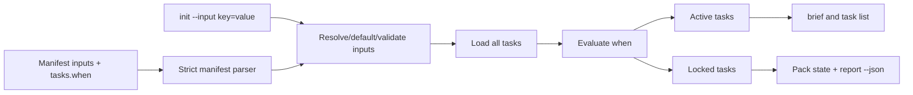
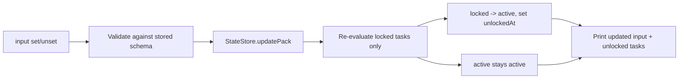

# Agent Pack Inputs and Conditional Tasks MVP

## Overview

Add a lightweight workflow-input system to `agent-pack`. Manifests can declare named inputs, `agent-pack init` captures and validates caller-provided values, briefs render the resolved inputs as structured context, and task definitions can declare simple YAML-only `when` conditions. Conditional tasks are stored in pack state but remain locked and hidden from normal agent-facing output until their conditions become true. After a task unlocks, it stays active.

## Motivation

Packs often need essential context, such as review scope or strictness, before an agent starts work. Inputs make that context explicit and validated, while conditional tasks allow manifests to defer later work without introducing template expansion or an expression language.

## Scope

In scope:

- Add manifest-level `inputs` definitions for `string`, `enum`, `boolean`, and `number`.
- Add task-level `when` conditions using simple YAML maps.
- Add repeatable `agent-pack init --input key=value`.
- Resolve, default, validate, and persist effective input values at init.
- Store all authored tasks, including locked tasks, while keeping work status separate from activation.
- Hide locked tasks from normal `brief`, `task list`, summaries, and active task counts.
- Render resolved inputs near the top of `brief`, after pack identity/name and before prompt/instructions.
- Add `agent-pack input list|get|set|unset` with validation, JSON output, and dynamic unlocking.
- Add minimal admin visibility via `task list --all`, `task list --locked`, and existing `report --json`.
- Extend completion for input subcommands, input keys, enum values, and boolean values.
- Update README, `docs/usage.md`, `CHANGELOG.md`, and tests.

Out of scope:

- Interpolation or template expansion into task titles, task bodies, instructions, refs, paths, or YAML files.
- Expression languages, command-line condition flags, negation, not-equals operators, OR conditions, or nested condition groups.
- Complex input types such as arrays, objects, files, paths, or secrets.
- Relocking already-unlocked tasks when inputs later change.
- Compatibility fallbacks or dual-shape parsers.

## Contract

Manifest input schema:

```yaml
schemaVersion: 1
name: code-review
inputs:
  scope:
    type: string
    required: true
    description: What code, docs, or behavior should the agent inspect?

  severity:
    type: enum
    values: [low, medium, high]
    default: medium
    description: Review strictness.

  include_tests:
    type: boolean
    default: true
    description: Whether to inspect related tests.
```

Input definition fields:

| Field | Required | Behavior |
|---|---:|---|
| `type` | no | Defaults to `string`. Supported values are `string`, `enum`, `boolean`, and `number`. |
| `required` | no | Defaults to `false`. Required inputs must have either an explicit value or a valid default. |
| `description` | no | Optional string rendered in brief and list output. |
| `default` | no | Used when no explicit value is provided. Must validate against the input type. |
| `values` | for enum | Non-empty list of allowed string values. Matching is exact and case-sensitive. |

CLI synopsis:

```bash
agent-pack init \
  --manifest review/code-review \
  --input scope="unstaged auth changes" \
  --input severity=high

agent-pack input list [--id <pack-id>] [--json]
agent-pack input get <name> [--id <pack-id>] [--json]
agent-pack input set <name> <value> [--id <pack-id>] [--json]
agent-pack input unset <name> [--id <pack-id>] [--json]

agent-pack task list [--id <pack-id>] [--all | --locked]
```

Input parsing and validation:

- `--input` values must be `key=value`.
- Duplicate values for the same key are resolved by last writer wins within the init command line.
- Unknown input key fails init or input mutation.
- Missing required input with no default fails init.
- Defaults satisfy optional or required inputs.
- `string` values are stored as strings; required strings must be non-empty after trimming.
- `enum` values must exactly match one configured `values` entry.
- `boolean` values accept `true`, `false`, `1`, and `0` on CLI and persist as booleans.
- `number` values are coerced from numeric strings and must be finite; reject `NaN`, `Infinity`, and non-numeric text.
- Empty `values` for enum, unknown input types, invalid defaults, and unsupported input metadata fields are manifest errors.

Task condition schema:

```yaml
tasks:
  - id: deep-review
    title: Deep review
    when:
      severity: high

  - id: write-report
    title: Write report
    when:
      report_path:

  - id: publish-report
    title: Publish report
    when: report_path

  - id: strict-review
    title: Strict review
    when:
      severity:
        in: [high, critical]

  - id: review-tests-strictly
    title: Review tests strictly
    when:
      severity: high
      include_tests: true
```

Condition behavior:

- A string `when` value is a single-input exists shorthand: `when: report_path` unlocks when input `report_path` exists and is not an empty string.
- A scalar value means equality: `severity: high` unlocks when the effective input value is `high`.
- An omitted or YAML `null` value means exists: the input key must be present and not an empty string.
- `{ in: [...] }` means set membership. The list must be non-empty.
- Multiple keys use AND semantics.
- `when` must be either an input-name string or a YAML object. String expressions such as `when: "severity == 'high'"` are errors because the string contains expression syntax rather than a valid input name.
- Unsupported operators such as `or`, `notEquals`, and `exists` are errors for MVP.
- Conditions may only reference declared inputs.

Pack behavior:

- All resolved tasks are stored in `PackState.tasks`.
- Tasks without `when`, and conditional tasks whose `when` evaluates true at init, are active.
- Conditional tasks whose `when` evaluates false are locked.
- Locked tasks are not pending work. They are hidden from default `brief`, `task list`, `task show`, active task counts, and summary blocked/completed totals.
- `report --json` returns full pack state, including locked tasks.
- `task list --all` returns active and locked tasks.
- `task list --locked` returns locked tasks only.
- Once a task becomes active, it never relocks. Changing inputs later cannot hide or deactivate a task that has already unlocked.
- Status-changing task commands should reject locked task IDs with a clear error such as `task is locked: t003`.

Input command output:

`agent-pack input list` text output should be tabular or one input per line with name, value, required flag, type, source, and description. `--json` returns an array:

```ts
Array<{
  name: string;
  value?: string | number | boolean;
  required: boolean;
  type: "string" | "enum" | "boolean" | "number";
  values?: string[];
  source?: "cli" | "default" | "set";
  description?: string;
}>
```

`agent-pack input get <name> --json` returns the same object for one input. Without `--json`, print the effective value only.

`agent-pack input set <name> <value>` validates and stores the value, updates `inputSources[name]` to `set`, recalculates locked tasks, and prints:

```text
Updated input severity.
Unlocked 2 tasks:
- t003 Deep review
- t004 Review tests strictly
```

When no tasks unlock, print only the update line plus a concise no-unlocks line if useful. With `--json`, return:

```ts
{
  input: InputStateEntry;
  unlocked: PackTask[];
  summary: ReturnType<typeof statusJson>;
}
```

`agent-pack input unset <name>` behavior:

- Required input without default: reject unset.
- Optional input without default: remove the effective value and source.
- Input with default: restore the default value and set source to `default`.
- Recalculate locked tasks but do not relock active tasks.
- Use the same text and JSON output shape as `set`.

Completion behavior:

- `agent-pack input <TAB>` suggests `list`, `get`, `set`, and `unset`.
- `agent-pack input get <TAB>`, `set <TAB>`, and `unset <TAB>` suggest input keys from the selected/default pack.
- `agent-pack input set severity <TAB>` suggests enum values such as `low`, `medium`, `high`.
- `agent-pack input set include_tests <TAB>` suggests `true` and `false`.
- String and number inputs do not suggest values.
- Completion is best-effort. If no pack resolves or state is unreadable, dynamic input candidates return empty output and normal static command/option completion still works.

Errors:

- All validation failures use `AgentPackError` and the existing nonzero CLI error path.
- State mutation errors should occur before writing partial state.
- `input set` and `input unset` should mutate inputs and unlock tasks inside one `StateStore.updatePack` call.

## Surface Inventory

| Name | Disposition | Layers | Symmetric peers | Removal twin |
|---|---|---|---|---|
| Manifest `inputs` | Added | `src/core/manifest/parse.ts`; `src/core/types.ts`; state validation; brief/docs/tests. | Existing `tasks`, `references`, `skills`, and `contract` manifest sections. | None. |
| Input fields `type`, `required`, `description`, `default`, `values` | Added | Manifest parser; types; state schema; `input list`; brief rendering. | Existing manifest metadata fields such as reference `description`. | None. |
| Task field `when` | Added | Manifest/task file parser; `loadTasks`; activation evaluator; state validation; tests. | Existing `doneWhen` is completion guidance, not activation. | None. |
| `--input <key=value>` | Added | `init` command; `InitInput`; input resolver; state persistence; smoke/docs. | Existing repeatable init flags such as `--manifest` and `--task`. | None. |
| `agent-pack input` | Added | Commander command group; core input operations; completion; docs/tests. | Existing `task`, `reference`, `skill`, and `catalog` groups. | None. |
| `input list` | Added | CLI; state load; text/JSON renderer; completion/docs/tests. | `task list`, `catalog list`. | None. |
| `input get <name>` | Added | CLI; state load; validation; text/JSON output; key completion. | `task show`, `catalog show`. | None. |
| `input set <name> <value>` | Added | CLI; input validation; `StateStore.updatePack`; unlock evaluator; event log; completion/docs/tests. | Task status mutation commands. | None. |
| `input unset <name>` | Added | CLI; default restoration/clearing; `StateStore.updatePack`; unlock evaluator; event log; completion/docs/tests. | `input set`. | None. |
| `task list --all` | Added | CLI option; list operation filtering; docs/tests. | `report --json` full-state visibility. | None. |
| `task list --locked` | Added | CLI option; list operation filtering; docs/tests. | `task list --all`. | None. |
| Brief `Inputs` section | Added | `src/core/brief/render.ts`; unit/integration/docs. | Existing `Prompt`, `Instructions`, and `Contract` sections. | None. |
| Dynamic input completion | Added | `src/cli/completion.ts`; state loading helpers; unit/smoke tests. | Catalog completion and option enum completion. | None. |

## Schema

Add input and activation types to `src/core/types.ts`:

```ts
export type PackInputType = "string" | "enum" | "boolean" | "number";
export type InputSource = "cli" | "default" | "set";
export type TaskActivation = "active" | "locked";

export interface PackInputDef {
  type: PackInputType;
  required: boolean;
  description?: string;
  default?: string | number | boolean;
  values?: string[];
}

export type PackInputValue = string | number | boolean;

export type TaskWhen = string | Record<string, TaskWhenCondition>;
export type TaskWhenCondition =
  | string
  | number
  | boolean
  | null
  | { in: Array<string | number | boolean> };

export interface PackTask {
  id: string;
  sourceId?: string;
  title: string;
  category?: string;
  body?: string;
  doneWhen?: string[];
  status: TaskStatus;
  notes: string[];
  source?: SourceInfo;
  activation?: TaskActivation;
  when?: TaskWhen;
  unlockedAt?: string;
  startedAt?: string;
  completedAt?: string;
  blockedAt?: string;
}

export interface PackState {
  schemaVersion: 1;
  id: string;
  name?: string;
  status: PackStatus;
  createdAt: string;
  updatedAt: string;
  repoRoot: string;
  prompt?: string;
  instructions?: string;
  taskCounts: TaskCounts;
  inputSchema?: Record<string, PackInputDef>;
  inputs?: Record<string, PackInputValue>;
  inputSources?: Record<string, { source: InputSource }>;
  tasks: PackTask[];
  references: PackReference[];
  skills: PackSkill[];
  contract?: PackContract;
}
```

Add manifest shapes:

```ts
export interface ManifestInputDef {
  type?: PackInputType;
  required?: boolean;
  description?: string;
  default?: unknown;
  values?: unknown[];
}

export interface ManifestTask {
  id?: string;
  title?: string;
  category?: string;
  body?: string;
  doneWhen?: string[];
  when?: TaskWhen;
  source?: SourceInfo;
}

export interface PackManifest {
  schemaVersion?: number;
  name?: string;
  instructions?: string;
  inputs?: Record<string, ManifestInputDef>;
  tasks?: Array<ManifestTask | string>;
  references?: Array<ManifestReference | string>;
  skills?: Array<ManifestSkill | string>;
  contract?: PackContract;
}
```

State validation changes:

- Add `inputSchema`, `inputs`, and `inputSources` to known pack fields.
- Add `activation`, `when`, and `unlockedAt` to known task fields.
- Validate `inputSchema` keys with a simple input-name rule, for example `^[A-Za-z_][A-Za-z0-9_-]*$`.
- Validate `inputs` values match stored `inputSchema`.
- Validate every `inputSources` key exists in `inputSchema` and every source is `cli`, `default`, or `set`.
- Validate every `when` key exists in `inputSchema`.
- Validate locked tasks have `activation: "locked"` and no in-progress/completed/blocked timestamps.
- Treat missing `activation` as active for newly-created tasks only if the implementation chooses optional storage; persisted validators should either require it for all tasks after this hot cut or normalize missing to active before validation. Prefer storing `activation` explicitly on all tasks.

Active task counts:

- `taskCounts` should count active tasks only.
- `derivePackStatus` should derive from active tasks only.
- If all tasks are locked and none are active, status should be `no_tasks`.

## Impact Surface

| File | Responsibility | Existing tests |
|---|---|---|
| `src/core/types.ts` | Defines `PackState`, `PackTask`, manifest task/manifest shapes, task counts, and command input types. Current `PackTask` only has work status and no activation fields. | Typechecked through `npm run typecheck`; integration tests validate persisted shape indirectly. |
| `src/core/manifest/parse.ts` | Strict YAML parser and validator. Known manifest keys currently exclude `inputs`, and task keys exclude `when`; unsupported fields fail through `assertKnownKeys`. | `test/integration/pack-workflow.test.ts` covers unsupported manifest fields, invalid task/reference/skill shapes, and malformed YAML. |
| `src/core/tasks/load.ts` | Converts manifest, task-file, catalog, local, and git task inputs into runtime `PackTask` entries with generated runtime IDs. | Integration tests cover manifest tasks, task refs, task ID generation, local/git task inputs, and missing task inputs. |
| `src/core/operations.ts` | Coordinates `initPack`, `brief`, task list/show/update, state mutations, and command-facing operations. This is the right home for input resolution and `input set/unset` operations. | Integration tests cover init, task add/update, brief, summaries, cache, references/skills, and state mutation events. |
| `src/core/state/status.ts` | Derives `taskCounts` and pack status from tasks. It currently counts every task regardless of activation. | Integration tests assert task counts/status for init, task add, update, completed packs, and persisted taskCounts. |
| `src/core/state/store.ts` | Loads, locks, validates, saves, indexes, and event-logs pack state. Known pack/task fields are strict and must be updated for new schema. | Integration tests cover corrupt state, unknown pack fields, invalid nested fields, stale locks, event behavior, and persisted state validation. |
| `src/core/brief/render.ts` | Renders agent-facing briefs, summaries, reports, and task detail. Inputs must render near the top; task rendering must hide locked tasks while report JSON remains complete. | `test/unit/brief-render.test.ts` covers section order, compact briefs, empty task packs, summaries, reports, and task rendering; integration tests cover brief content. |
| `src/cli/agent-pack.ts` | Registers `init`, `task`, `reference`, `skill`, `catalog`, completion, report, summary, and status commands. Add `--input`, `input` command group, task list flags, and JSON/text output. | Smoke tests in `test/smoke/cli-git-smoke.test.ts` cover command wiring, JSON output, errors, and completion. |
| `src/cli/completion.ts` | Resolves subcommand, option, catalog, and enum completion candidates from the Commander tree. Needs best-effort dynamic pack input key/value completion. | `test/unit/completion.test.ts` covers resolver metadata and catalog candidates; smoke tests cover generated shell scripts and CLI completion. |
| `README.md`, `docs/usage.md`, `CHANGELOG.md` | User-facing command reference, compact examples, and release notes. | Manual verification; README behavior also appears in smoke tests where examples overlap. |

## Higher-Level Implementation Steps

- Extend `src/core/types.ts` with input definitions, input values, input sources, task activation, and task condition types.
- Update manifest parsing in `src/core/manifest/parse.ts` to accept and validate `inputs` and task `when` with explicit MVP-only shapes.
- Add an input resolution module, for example `src/core/inputs.ts`, that normalizes schemas, parses CLI assignments, coerces values by type, validates defaults, resolves effective values, evaluates `when`, and computes unlock transitions.
- Update `initPack` to collect manifest input schemas in source order, reject conflicting duplicate input definitions, resolve CLI inputs/defaults, load all tasks, set each task's activation, and persist input state.
- Update state validation and status derivation so persisted input fields and activation fields are strict, while `taskCounts` and pack status use active tasks only.
- Update `brief`, `task list`, `task show`, and task mutation operations to use active task filtering by default; keep full state visible through `report --json` and `task list --all`.
- Add `input list|get/set/unset` core operations and CLI commands, with set/unset mutating inputs and unlocking tasks inside a single `StateStore.updatePack`.
- Extend completion metadata and resolver behavior for input keys and enum/boolean values, failing silently for dynamic completion errors.
- Update docs/changelog and add focused integration, unit, and smoke tests.

## Diagrams





## Risks

- Strict parser risk: `src/core/manifest/parse.ts` and `src/core/state/store.ts` reject unknown fields today, so every new field must be added to both manifest and state validators.
- State-count risk: locked tasks stored in `tasks` must not inflate active task counts or make a pack look pending before work is available.
- Lifecycle risk: dynamic input changes must only unlock tasks; relocking active tasks would make previously visible work disappear.
- Concurrency risk: `input set` and `input unset` must validate, update inputs, evaluate unlocks, save state, and emit events inside one pack lock.
- Visibility risk: hiding locked tasks by default can make debugging confusing unless `task list --all`, `task list --locked`, and `report --json` are reliable.
- Parser ambiguity risk: string `when` values, YAML omitted values, and `null` values are easy to mishandle; string values must be parsed as input-name exists shorthand only when they are valid declared input names, and omitted/null map values should also mean exists checks for MVP.
- Completion risk: dynamic input completion needs pack state reads but shell completion must not print errors or create state; failures should return no dynamic candidates.
- Scope risk: interpolation is explicitly out of scope. The implementation should not partially substitute inputs into any string fields.

## Test Strategy

Unit tests:

- Add input schema normalization/coercion tests for string, required string, enum, boolean, number, defaults, invalid defaults, unknown types, empty enum values, duplicate CLI assignments, and malformed `key=value`.
- Add condition evaluator tests for equality, exists via omitted/null map value, exists via string shorthand, `in`, AND semantics, unknown input keys, unsupported operators, expression-looking strings, empty `in`, and type mismatches.
- Extend brief-render tests to assert the Inputs section appears after identity/name and before Prompt/Instructions, and that locked tasks do not render in the default task section.
- Extend completion unit tests for `input` subcommands, input key completion, enum value completion, boolean value completion, and silent fallback when a pack cannot be loaded.

Integration tests:

- `initPack` with required inputs succeeds with `--input` and fails without required no-default inputs.
- Defaults populate optional and required inputs and set `inputSources` to `default`.
- Unknown `--input`, invalid enum, invalid boolean, invalid number, invalid `inputs` schema, and invalid `when` fail before state is written.
- Init stores all tasks but only active tasks appear in `brief`, `task list`, summaries, and active counts.
- `input set` unlocks equality, exists, `in`, and AND-conditioned tasks and stamps `unlockedAt`.
- `input unset` rejects required/no-default input, clears optional/no-default input, restores defaults, and never relocks active tasks.
- Locked tasks reject `task start`, `task note`, `task done`, and `task block`.
- `report --json` includes locked tasks and input metadata.
- State validation rejects unknown input fields, malformed input values, malformed activation, and invalid `when`.

Smoke tests:

- CLI `init --input scope=... --input severity=high` creates a pack and brief renders inputs.
- CLI `input list|get/set/unset --json` returns expected shapes.
- CLI `task list`, `task list --all`, and `task list --locked` differ as expected.
- CLI completion suggests `input` subcommands, keys, enum values, and boolean values.

Check commands:

```bash
npm run lint
npm run typecheck
npm test
npm run test:smoke
npm run check
```

## Open Assumptions

- Input names should use a conservative identifier rule, such as `^[A-Za-z_][A-Za-z0-9_-]*$`, because the prompt requires named inputs but does not specify allowed characters.
- Multiple manifests may contribute inputs. The preferred MVP behavior is to reject conflicting duplicate input definitions unless they are structurally identical; this avoids source-order surprises.
- If multiple `--input` assignments set the same key in one init command, last writer wins.
- Store `activation: "active"` explicitly on all tasks rather than relying on missing activation to mean active.
- Text output formatting can be plain and tabular as long as JSON output is exact and tests pin the machine-readable shapes.
