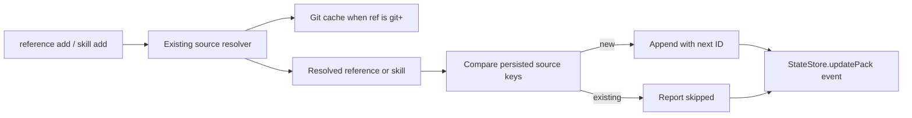

# Reference and Skill Add Commands

## Overview

Add post-init composition commands for references and skills so users can evolve an existing pack with `agent-pack reference add <ref>` and `agent-pack skill add <ref>`. The commands should reuse the same reference strings, source resolution, git cache behavior, metadata inference, state persistence, and summary rendering patterns already used by `init` and `task add`.

## Motivation

`agent-pack init` already accepts references and skills, but it forces users to know all context at creation time. Additive commands let users and agents compose packs incrementally without adding destructive removal commands or requiring names and IDs for common cases.

## Scope

In scope:

- Add `agent-pack reference add <ref>` and `agent-pack skill add <ref>`.
- Reuse existing `init --reference` and `init --skill` ref formats and resolution behavior.
- Infer names, descriptions, paths, and source metadata through existing resolvers.
- Use each resolved entity's persisted `source` object as the simple dedup key.
- Fetch and materialize git-backed refs at add time using the existing git cache and `--git-refresh` policy.
- Append new entities with stable next `rNNN` / `sNNN` IDs without renumbering existing entries.
- Support text output and `--json`.
- Update completion, docs, changelog, and tests.

Out of scope:

- `task remove`.
- `reference remove` or `skill remove`.
- Advanced git resync/update behavior for already-added sources.
- New required `--name`, `--description`, or entity ID arguments.
- Persisted schema changes.
- Compatibility aliases, fallback parsers, or dual-shape readers.

## Contract

CLI synopsis:

```bash
agent-pack reference add <ref> [--id <pack-id>] [--git-refresh <auto|always|never>] [--json]
agent-pack skill add <ref> [--id <pack-id>] [--git-refresh <auto|always|never>] [--json]
```

Arguments and flags:

- `<ref>`: required string. For `reference add`, accepts the same formats as `init --reference`: bare catalog refs, explicit local paths/globs, HTTP/HTTPS URLs, and git refs. For `skill add`, accepts the same formats as `init --skill`: bare catalog refs, explicit local `SKILL.md` files, directories, globs, and git refs resolving to one or more `SKILL.md` files.
- `--id <pack-id>`: optional pack ID. If omitted, `AGENT_PACK_ID` selects the pack, matching existing pack commands.
- `--git-refresh <policy>`: optional git fetch policy with `auto`, `always`, and `never`, using the existing default behavior.
- `--json`: optional machine-readable output.

Behavior:

- Resolve `<ref>` at command execution time through `resolveReferences` or `resolveSkills`.
- Git refs use the existing cache path through `materializeGitRef`; missing cache with `--git-refresh never` fails through the existing git cache error behavior.
- For each resolved reference or skill, compute a dedup key from `JSON.stringify(entity.source)`.
- If an existing pack entity has the same source key, skip the resolved entity as already present.
- Append only non-duplicate entities. Existing references and skills keep their order and IDs.
- Assign new IDs after existing entries using the next available `rNNN` or `sNNN`.
- For skill refs that resolve multiple `SKILL.md` files, dedup and append per resolved skill.
- Use resolver-inferred names/descriptions/paths. Do not add name or description flags in this pass.
- Record a state event with the input ref, added count, skipped count, and added/skipped IDs where available.

Text output:

```text
Added 1 reference to pack reviewer-001; skipped 0 already present.
Pack: reviewer-001
...
```

```text
No new skills added to pack reviewer-001; skipped 2 already present.
Pack: reviewer-001
...
```

JSON output:

```ts
{
  references: PackReference[],
  skipped: PackReference[],
  summary: ReturnType<typeof statusJson>
}
```

```ts
{
  skills: PackSkill[],
  skipped: PackSkill[],
  summary: ReturnType<typeof statusJson>
}
```

Errors:

- Missing pack, invalid pack ID, invalid git refresh policy, missing local refs, missing catalog refs, invalid URL credentials, git cache missing with `--git-refresh never`, and skill sources resolving no `SKILL.md` files use existing `AgentPackError` handling and nonzero CLI exit behavior.
- Duplicate resolved sources are not errors.

Examples:

```bash
agent-pack reference add ./docs/api.md --id reviewer-001
agent-pack reference add product/api
agent-pack reference add https://example.com/docs/design.md --json
agent-pack skill add ./skills/review/SKILL.md --id reviewer-001
agent-pack skill add engineering/fresh-eyes --git-refresh never
```

## Surface Inventory

| Name | Disposition | Layers | Symmetric peers | Removal twin |
|---|---|---|---|---|
| `agent-pack reference` | Added | Commander command group in `src/cli/agent-pack.ts`; core operation in `src/core/operations.ts`; state mutation through `StateStore`; docs, completion, and tests. | `agent-pack skill`, existing `agent-pack task`, existing `agent-pack catalog`. | None. |
| `agent-pack reference add <ref>` | Added | CLI parser; `resolveReferences`; source-key dedup; `StateStore.updatePack`; text/JSON output; integration and smoke tests. | `init --reference`, `init --references`, `agent-pack skill add`. | None. |
| `agent-pack skill` | Added | Commander command group in `src/cli/agent-pack.ts`; core operation in `src/core/operations.ts`; state mutation through `StateStore`; docs, completion, and tests. | `agent-pack reference`, existing `agent-pack task`, existing `agent-pack catalog`. | None. |
| `agent-pack skill add <ref>` | Added | CLI parser; `resolveSkills`; source-key dedup; `StateStore.updatePack`; text/JSON output; integration and smoke tests. | `init --skill`, `init --skills`, `agent-pack reference add`. | None. |
| `--git-refresh <policy>` on `reference add` and `skill add` | Added | Existing CLI option helper; resolver refresh argument; git cache materialization. | `init --git-refresh`, `sync --git-refresh`. | None. |
| `--json` on `reference add` and `skill add` | Added | CLI output branch and smoke tests. | `task add --json`, other command JSON flags. | None. |

## Schema

_No schema changes._

Existing persisted shapes are sufficient. `PackReference` stores `id`, `name`, optional `description`, `source`, and exactly one of `path`, `rootPath`, or `files`; `PackSkill` stores `id`, `name`, optional `description`, `source`, and `path` in `src/core/types.ts:57-73`. Source identity is already represented by `SourceInfo` variants in `src/core/types.ts:5-40`.

## Impact Surface

| File | Responsibility | Existing tests |
|---|---|---|
| `src/cli/agent-pack.ts` | Registers root commands, `init`, `task`, and `catalog`. `init` reference/skill flags are at `src/cli/agent-pack.ts:219-249`; `task add` output and option patterns are at `src/cli/agent-pack.ts:276-306`; `gitRefreshOption` is at `src/cli/agent-pack.ts:452-455`. | CLI smoke tests in `test/smoke/cli-git-smoke.test.ts`; completion unit tests in `test/unit/completion.test.ts`. |
| `src/core/operations.ts` | Coordinates pack creation and mutations. `initPack` collects reference and skill refs at `src/core/operations.ts:47-83` and resolves them at `src/core/operations.ts:90-93`; `addTask` is the closest mutation model at `src/core/operations.ts:311-345`. | Integration tests in `test/integration/pack-workflow.test.ts` cover init, task add, state mutation, and error behavior. |
| `src/core/sources/resolve.ts` | Resolves references and skills. `resolveReferences` and `resolveSkills` assign initial IDs at `src/core/sources/resolve.ts:22-58`; reference resolution covers local, catalog, URL, and git at `src/core/sources/resolve.ts:60-223`; skill resolution covers local, catalog, and git at `src/core/sources/resolve.ts:225-337`. | Integration tests cover local refs, catalog refs, skill directories, URL references, and missing input errors. |
| `src/core/git/cache.ts` and `src/core/git/ref.ts` | Parse git refs, sanitize URLs, reuse/fetch mirrors, resolve commits, and materialize snapshots. `materializeGitRef` records the persisted git source at `src/core/git/cache.ts:20-55`; refresh policy is enforced at `src/core/git/cache.ts:93-108`; git ref parsing is in `src/core/git/ref.ts:29-56`. | Integration and smoke tests cover git source resolution, cache hydration, cache cleaning, and unsafe git paths. |
| `src/core/state/store.ts` | Loads, validates, locks, mutates, saves, indexes, and event-logs pack state. `updatePack` is at `src/core/state/store.ts:164-176`; reference/skill validation is at `src/core/state/store.ts:385-427`. | Integration tests cover corrupt state rejection, stale locks, concurrent task updates, and persisted schema validation. |
| `src/cli/completion.ts` | Derives command, option, enum, and catalog completion candidates from the Commander tree and attached metadata. Catalog ref metadata helpers are at `src/cli/completion.ts:53-67`, and value resolution is at `src/cli/completion.ts:260-283`. | `test/unit/completion.test.ts:33-78` and smoke completion tests cover catalog-backed completion and command/option candidates. |
| `src/core/brief/render.ts` | Renders references and skills into briefs and reports. Brief reference rendering is at `src/core/brief/render.ts:92-115`, skill rendering at `src/core/brief/render.ts:116-132`, report rendering at `src/core/brief/render.ts:206-245`. | Integration tests assert rendered URL references and brief content. |
| `README.md`, `docs/usage.md`, `CHANGELOG.md` | User-facing command reference, compact usage docs, and release notes. README documents pack purpose at `README.md:1-5`, git refresh semantics at `README.md:374-400`, task commands at `README.md:433-452`, and catalog ref behavior at `README.md:520-549`. | Documentation is manually verified; changelog convention is documented in `AGENTS.md:36-41`. |

## Higher-Level Implementation Steps

- Add `addReferences` and `addSkills` core operations that resolve refs using existing resolvers, then dedup and append inside `StateStore.updatePack`.
- Add small helpers for source-key creation, next `rNNN`/`sNNN` ID selection, and separating added vs skipped entities.
- Register `reference add` and `skill add` command groups in `src/cli/agent-pack.ts`, reusing `gitRefreshOption`, `--id`, and `--json` patterns from existing commands.
- Keep output aligned with `task add`: default text prints a concise add/skip line plus `renderSummary`; JSON prints added/skipped entities and summary.
- Update completion tests and metadata so new command/subcommand/option candidates appear, and catalog refs complete for `<ref>` when the active command is `reference add` or `skill add`.
- Add integration tests for local, catalog, URL, git/cache, duplicate, multi-skill, and next-ID behavior.
- Update README, `docs/usage.md`, and CHANGELOG under `## [Unreleased]`.

## Diagrams



## Risks

- Source-key dedup with `JSON.stringify(entity.source)` is simple and sufficient if source objects are created by existing resolvers, but it is order-sensitive if future code constructs equivalent objects with different key order.
- `resolveReferences` and `resolveSkills` currently assign IDs starting at `r001` / `s001`; add operations must reassign new IDs after filtering and must not renumber existing entries.
- Skill directory and glob refs can resolve multiple `SKILL.md` files; dedup and ID assignment must happen per resolved skill.
- Resolving before acquiring the pack lock avoids holding the lock during git I/O, but dedup and ID assignment must happen inside `StateStore.updatePack` against the latest pack state to handle concurrent add commands.
- Git refs resolve at add time. With `auto`, an existing mirror may produce the currently cached commit; with `always`, it may fetch a newer commit. That behavior should stay explicit and match current refresh semantics.
- New command names should complete automatically from Commander, but catalog value completion for the `<ref>` positional may require new argument metadata beyond the existing option helper.
- Output must be clear when everything is skipped, otherwise agents may assume a pack changed when it did not.

## Test Strategy

New and expanded tests:

- Integration tests for `addReferences` and `addSkills` covering local file reference, URL reference, catalog reference metadata, local skill file, skill directory multi-add, duplicate skip, next ID assignment after existing entries, and `AGENT_PACK_ID` selection.
- Git-backed add test using existing git fixture patterns, including `--git-refresh never` missing-cache failure or cached-material reuse.
- CLI smoke tests for `agent-pack reference add` and `agent-pack skill add` text output and `--json` output.
- Completion unit/smoke tests for `reference`, `skill`, `add`, `--id`, `--git-refresh`, `--json`, and catalog candidates for `<ref>` if supported.
- Documentation updates in README and `docs/usage.md`; changelog entry under `## [Unreleased]`.

Check commands:

```bash
npm run lint
npm run typecheck
npm test
npm run test:smoke
npm run check
```

## Open Assumptions

- Dedup by persisted `source` object is intentionally sufficient; the design does not try to dedup by display name, rendered path, git requested ref, or source file contents.
- Two entries with the same source but different inferred or catalog-provided names/descriptions are treated as the same entity.
- If a git branch moves and the selected refresh policy resolves a different `resolvedCommit`, the new source key may be considered distinct. A future update/resync command can address that explicitly if needed.
- Additive commands should not create destructive remove surfaces in this pass.
- Name and description override flags can be added later if users need them, but the first pass keeps the CLI ergonomic and resolver-driven.
