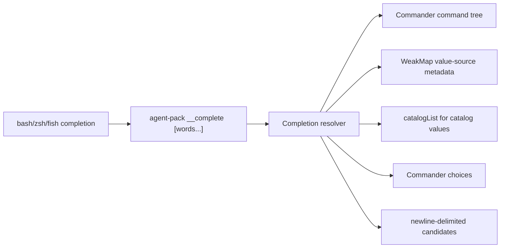

# Shell Completion Commands, Options, and Values

## Overview

Expand `agent-pack` shell completion so the generated bash, zsh, and fish scripts complete the full current CLI surface: command names, nested subcommands, command-specific option names, explicit enum values, and the catalog-backed values already supported today. Completion candidates should be derived from the configured Commander command tree wherever Commander already has the metadata, with small attached metadata only for value sources Commander cannot infer. The feature is grounded in GitHub issue #1 plus the added requirement to complete subcommands.

## Motivation

Completion currently helps with catalog refs, but it leaves common CLI discovery paths incomplete. A user typing `agent-pack init --mani<TAB>` or `agent-pack task d<TAB>` should get useful candidates from the installed CLI rather than needing to remember every flag and subcommand.

## Scope

In scope:

- Complete top-level command names and nested subcommands.
- Complete option names for the current command path.
- Complete option names at command positions when no app-known positional value exists.
- Complete explicit enum values for `--git-refresh`, `--type`, catalog type positionals, and completion shell arguments.
- Preserve existing catalog-name completion for manifest, task, reference, skill, and `catalog show|path` values.
- Preserve explicit path-prefix suppression for catalog-backed values: `/`, `./`, `../`, `~`, and `~/` return no catalog candidates.
- Update generated bash, zsh, and fish scripts, tests, README, usage docs, and changelog.

Out of scope:

- Do not change ordinary CLI command behavior, text output, JSON output, or exit codes.
- Do not add command aliases, bridge routes, fallback parsers, or dual helper contracts.
- Do not add completions for dynamic pack IDs or task IDs.
- Do not fall through to shell filesystem completion for ordinary empty app candidate sets.
- Do not change persisted pack state or catalog schemas.

## Contract

CLI synopsis:

```bash
agent-pack completion script <shell>
```

The command continues to print a shell completion script for `bash`, `zsh`, or `fish`. The generated scripts complete candidates for `agent-pack` invocations by consulting a completion resolver derived from the same Commander `Command` objects that define the CLI.

Internal helper contract:

```bash
agent-pack __complete <prefix> [words...]
```

- `<prefix>` is the current incomplete token.
- `[words...]` are completed tokens after `agent-pack` and before `<prefix>`.
- Output is newline-delimited candidates on stdout.
- Empty match sets print nothing and exit `0`.
- Unsupported internal completion contexts may raise `AgentPackError` and exit `1` through the existing CLI error wrapper.
- This is a hot cut of the hidden helper shape; it is not a public user command.

Completion model:

- Build the CLI through a function such as `configureProgram(): Command` so ordinary parsing and completion can share the same configured Commander tree.
- Derive command and subcommand candidates from `Command.commands`, excluding hidden commands such as `__complete`.
- Derive option-name candidates from the active `Command.options`, using each visible option's `long` flag. The project currently has long-only user options, so short option completion is not part of this feature.
- Derive enum candidates from Commander choices where available: `Option.argChoices` for option values and `Argument.argChoices` for positional values.
- Prefer Commander choice declarations over separate completion lists. `gitRefreshOption()`, `catalogTypeOption()`, and `catalogTypeArgument()` already use `.choices(...)`; `completion` shell arguments should be refactored to use `Argument(...).choices(completionShells)` instead of relying only on `normalizeShell()`.
- Attach only non-Commander completion semantics with a small local metadata layer, preferably a `WeakMap<Option | Argument, CompletionValueSource>` populated by helper constructors. Required metadata includes catalog value sources for `--manifest`, `--manifests`, `--task`, `--tasks`, `--reference`, `--references`, `--skill`, `--skills`, and the catalog-name positional after `catalog show|path <type>`.
- Keep catalog value generation through `catalogList(...)` and keep `isExplicitCompletionPath(...)` as the explicit path-prefix suppression gate.
- Catalog value completion should use read-only catalog listing and must not create missing catalog directories as a TAB side effect.
- Catalog names emitted to shell completion should be filtered through the catalog-name contract before they reach shell helpers.
- When no app-known positional candidate exists for the active command, return that command's option names.
- Avoid a manually duplicated command/option table. If an option is added to Commander, its name should become completable automatically unless it is hidden.

Command candidates:

- Top-level: `init`, `brief`, `sync`, `clean`, `list`, `task`, `catalog`, `completion`, `status`, `report`, `summary`.
- `task`: `add`, `list`, `show`, `start`, `note`, `done`, `block`.
- `catalog`: `list`, `show`, `path`.
- `completion`: `script`.

Option candidates:

- `init`: `--id`, `--name`, `--manifest`, `--manifests`, `--instructions`, `--add-task`, `--task`, `--tasks`, `--reference`, `--references`, `--skill`, `--skills`, `--git-refresh`, `--state-dir`, `--json`.
- `brief`: `--id`.
- `sync`: `--id`, `--git-refresh`, `--json`.
- `clean`: `--id`, `--json`.
- `list`: `--json`.
- `status`: `--json`.
- `report`: `--id`, `--json`.
- `summary`: `--id`, `--json`.
- `task add`: `--id`, `--category`, `--body`, `--done-when`, `--json`.
- `task list`: `--id`.
- `task show`: `--id`, `--json`.
- `task start`, `task done`, `task block`: `--id`, `--note`.
- `task note`: `--id`.
- `catalog list`: `--type`, `--json`.

At command positions with no app-known positional values, completion returns option candidates. For example, `agent-pack brief <TAB>` returns `--id`, and `agent-pack task done <TAB>` returns `--id` and `--note`.

Enum and value candidates:

- `--git-refresh`: `auto`, `always`, `never`.
- `--type`: `manifest`, `task`, `reference`, `skill`.
- `catalog show|path` first positional: `manifest`, `task`, `reference`, `skill`.
- `catalog show|path` second positional: catalog names for the selected type.
- `completion [shell]` and `completion script <shell>`: `bash`, `zsh`, `fish`.
- `--manifest` and `--manifests`: manifest catalog names.
- `--task` and `--tasks`: task catalog names.
- `--reference` and `--references`: reference catalog names.
- `--skill` and `--skills`: skill catalog names.

Examples:

```bash
agent-pack init --mani<TAB>
# --manifest
# --manifests

agent-pack task d<TAB>
# done

agent-pack sync --git-refresh a<TAB>
# auto

agent-pack catalog list --type m<TAB>
# manifest
```

Compatibility and migration:

- Hot cut only for generated completion scripts and the hidden helper.
- No aliases, bridge routes, or dual-shape completion parsers.
- Existing catalog value completion and explicit path-prefix suppression must continue to work.

## Surface Inventory

| Name | Disposition | Layers | Symmetric peers | Removal twin |
|---|---|---|---|---|
| `agent-pack completion script bash` | Changed | Bash script generator in `src/cli/completion.ts`; hidden helper; smoke tests; docs. | zsh and fish script generators. | None. |
| `agent-pack completion script zsh` | Changed | Zsh script generator in `src/cli/completion.ts`; hidden helper; smoke tests; docs. | bash and fish script generators. | None. |
| `agent-pack completion script fish` | Changed | Fish script generator in `src/cli/completion.ts`; hidden helper; smoke tests; docs. | bash and zsh script generators. | None. |
| `__complete` | Changed internally | Hidden Commander command; completion candidate dispatcher; smoke tests. | Generated shell scripts. | Old catalog-only helper shape. |
| Top-level command candidates | Added | Commander `Command.commands`; helper context parser; generated shell scripts; tests. | Commander top-level command definitions. | None. |
| `task` subcommand candidates | Added | Commander `Command.commands`; helper context parser; generated shell scripts; tests. | `configureTaskCommands`. | None. |
| `catalog` subcommand candidates | Added | Commander `Command.commands`; helper context parser; generated shell scripts; tests. | `configureCatalogCommands`. | None. |
| `completion script` candidate | Added | Commander `Command.commands`; helper context parser; generated shell scripts; tests. | `configureCompletionCommands`. | None. |
| Option-name candidates | Added | Commander `Command.options`; helper context parser; generated shell scripts; tests; docs. | Commander option definitions. | None. |
| `auto`, `always`, `never` | Added as completion values | Commander `Option.argChoices`; `--git-refresh` value context; tests. | `gitRefreshOption()` choices. | None. |
| `manifest`, `task`, `reference`, `skill` | Changed | `--type`, catalog type positional, and catalog-name completion contexts. | `catalogTypes`, `catalogTypeOption()`, `catalogTypeArgument()`. | None. |
| `bash`, `zsh`, `fish` | Added as completion values | Commander `Argument.argChoices` on `completion` and `completion script`; tests. | `normalizeShell()`. | None. |
| Catalog ref/name completions | Preserved | `catalogList`, explicit path-prefix suppression, generated shell scripts, smoke tests. | Catalog command and init ref options. | None. |

## Schema

_No schema changes._

## Impact Surface

| File | Responsibility | Existing tests |
|---|---|---|
| `src/cli/main.ts` | Thin executable bin wrapper that imports `configureProgram()` and calls `parseAsync(process.argv)`. | Smoke tests cover direct CLI invocation and symlinked bin invocation. |
| `src/cli/agent-pack.ts` | Side-effect-free CLI module that registers all commands and options through `configureProgram` and exposes Commander metadata through helper constructors. | Unit tests import `configureProgram()` without parsing process arguments; smoke tests cover command behavior through the bin wrapper. |
| `src/cli/completion.ts` | Defines shell completion setup, owns `__complete`, `completionCandidates`, `isExplicitCompletionPath`, the Commander-derived resolver, custom completion metadata, hidden-command tracking, and generated bash/zsh/fish scripts. | Smoke and unit tests cover completion setup, command/subcommand candidates, option candidates, enum values, catalog values, explicit path-prefix suppression, and metadata drift guards. |
| `node_modules/commander/typings/index.d.ts` | Confirms Commander exposes the structured metadata needed for derived completion: `Command.commands`, `Command.options`, `Command.registeredArguments`, `Option.argChoices`, and `Argument.argChoices`. | Dependency type surface used by TypeScript. |
| `src/core/catalog.ts` | Exports `catalogTypes`, validates catalog-name shape, and lists catalog entries used by completion. Completion should use read-only listing so TAB does not create catalog directories. | Smoke tests cover catalog listing and existing catalog completion. |
| `src/core/types.ts` | Defines `GitRefresh` as `auto | always | never`, matching `--git-refresh` completion values. | Typecheck covers the union; smoke tests exercise CLI values. |
| `test/smoke/cli-git-smoke.test.ts` | End-to-end CLI tests through the built `dist/cli/main.js`, plus a symlinked-bin invocation check for installed CLI behavior. | Completion smoke tests assert generated scripts, command/subcommand candidates, option candidates, enum values, catalog candidates, explicit path-prefix suppression, and read-only catalog listing. |
| `test/helpers/cli.ts` | Runs the built CLI in isolated test environments with agent-pack env vars reset. | Used by all smoke tests. |
| `README.md` | Full command reference and completion behavior docs. Completion section currently documents catalog-name completion only at lines 573-592. | Documentation is not currently test-enforced. |
| `docs/usage.md` | Compact installed usage reference. Completion docs currently mention catalog names and explicit path-prefix behavior at lines 141-149. | Documentation is not currently test-enforced. |
| `CHANGELOG.md` | User-facing completion change should be added under `## [Unreleased]`. | Repository convention, not test-enforced. |

## Higher-Level Implementation Steps

- Refactor CLI construction into a function that returns the configured root `Command`, then use that same root for `parseAsync(...)` and completion resolution.
- Replace the catalog-only hidden helper with a context-aware helper that receives the current prefix and prior command words.
- Implement a small completion resolver that walks the Commander command tree, identifies the active command path, detects option-name vs option-value position, and dispatches to derived command, option, choice, catalog, or empty candidates.
- Add helper constructors for options/arguments that need custom completion metadata, backed by a `WeakMap<Option | Argument, CompletionValueSource>`.
- Refactor shell arguments for `completion` and `completion script` to use Commander `Argument.choices(...)`, keeping `normalizeShell()` for validation and detection.
- Keep catalog candidate resolution through `catalogList` and keep `isExplicitCompletionPath` as the catalog explicit path-prefix suppression gate.
- Use read-only catalog listing for completion callers, and filter returned catalog names through the catalog-name validator before shell emission.
- Update bash, zsh, and fish script generators so each shell passes consistent context into the helper.
- Keep completion app-driven: shell scripts should not invoke default file completion when the helper returns no candidates.
- Expand smoke tests for top-level commands, nested subcommands, option names, enum values, catalog values, explicit path fallback, and generated script wiring.
- Update README, docs usage, and changelog to describe the expanded completion behavior.

## Diagrams



## Risks

- A derived model reduces command/option drift, but custom value-source metadata can still drift if a catalog-backed option or positional is added without metadata.
- Bash, zsh, and fish expose current-word and prior-word context differently, so scripts can accidentally pass inconsistent words to the helper.
- The resolver can confuse option-name completion with option-value completion, especially around nested commands and optional `completion` shell arguments.
- Catalog value completion can regress explicit path-prefix suppression.
- Commands with unknown free-text positionals can feel empty if option fallback does not trigger.
- Enum values can drift if new choices are not declared through Commander `choices(...)`.
- The hidden helper hot cut requires updating tests that currently call `agent-pack __complete <catalog-type> <prefix>`.
- Empty matches and unsupported internal contexts need predictable output so shell scripts do not show noisy errors.

## Test Strategy

New or expanded tests:

- Smoke tests in `test/smoke/cli-git-smoke.test.ts` for top-level command completion, `task` subcommands, `catalog` subcommands, and `completion script`.
- Smoke tests for option-name candidates on representative commands: `init`, `sync`, `task add`, `task done`, and `catalog list`.
- Smoke tests for enum/value candidates: `--git-refresh`, `--type`, catalog type positionals, and `bash|zsh|fish`.
- Preserve and expand existing catalog tests for manifest/task/ref/skill names and explicit path-prefix suppression.
- Script-generation assertions for bash, zsh, and fish to confirm all scripts delegate to the same context helper.
- Unit tests for the pure completion resolver using a configured Commander root, including assertions that command and option candidates are derived from the actual command tree.
- A drift guard test that walks known catalog-backed options and catalog-name arguments and verifies each has custom completion metadata.

Check commands:

```bash
npm run lint
npm run typecheck
npm test
npm run test:smoke
npm run check
```

## Open Assumptions

- The feature brief is issue #1 plus the user's explicit request to include subcommand tab completion.
- `__complete` is treated as hidden internal plumbing, so its argument shape can change without a public compatibility layer.
- Commander 12.1.0's exposed `commands`, `options`, `registeredArguments`, and `argChoices` fields are stable enough for this internal resolver because they are present in the installed package typings.
- Completion support remains limited to scripts generated by `agent-pack completion script bash|zsh|fish`.
- Dynamic pack ID and task ID completion is intentionally out of scope because issue #1 only names option, enum, catalog, and now subcommand behavior.
