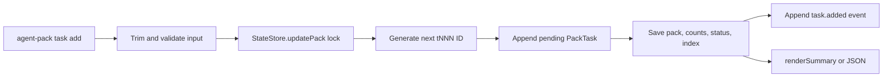

# Agent Pack Task Add

## Overview

Add a post-init `agent-pack task add <title> [options]` command that appends an ad hoc pending task to an existing pack. The command should use the existing task schema and state mutation path, generate the next runtime `tNNN` task ID, update derived pack counts/status, emit a `task.added` event, and support both the existing human summary style and a new `--json` response for scripts.

## Motivation

Existing packs can only receive ad hoc tasks during `agent-pack init --add-task`, while real agent work often discovers follow-up tasks after the pack already exists. A dedicated `task add` command keeps `init` focused on pack creation and matches the existing `task list/show/start/note/done/block` command group.

## Scope

In scope:

- Add `agent-pack task add <title>` under the existing `task` command group.
- Support `--id`, `--category`, `--body`, repeatable `--done-when`, and `--json`.
- Validate empty title, category, body, and done-when entries before mutating state.
- Append a pending `PackTask` using existing fields only.
- Generate the next runtime task ID from existing `tNNN` IDs while avoiding all collisions.
- Persist through `StateStore.updatePack`, recomputing counts, pack status, index, updated timestamp, and event log.
- Update README, usage docs, changelog, and tests for the user-facing command.

Out of scope:

- Do not overload `agent-pack init` to mutate existing packs.
- Do not add command aliases, bridge routes, fallback parsing, or compatibility layers.
- Do not parse comma-separated `--done-when` values.
- Do not add persisted schema fields or migrations.

## Contract

CLI synopsis:

```bash
agent-pack task add <title> [options]
```

Arguments and flags:

- `<title>`: required string positional. Trim before validation and persistence. Reject if empty after trimming.
- `--id <id>`: optional pack ID. Same semantics as existing task commands: explicit ID selects the pack; otherwise `AGENT_PACK_ID` may select it; missing/invalid/missing pack errors use existing state-store error behavior.
- `--category <category>`: optional string. Trim before persistence. Reject if provided but empty after trimming.
- `--body <text>`: optional string task details. Trim before persistence. Reject if provided but empty after trimming.
- `--done-when <criterion>`: optional repeatable string completion criterion. Each occurrence is one array entry. Trim entries before persistence. Reject any provided entry that is empty after trimming. Do not parse comma-separated criteria.
- `--json`: optional boolean. When present, emit machine-readable output instead of the human summary.

Core operation:

```ts
addTask(input: {
  packId?: string;
  title: string;
  category?: string;
  body?: string;
  doneWhen?: string[];
}): Promise<{ pack: PackState; task: PackTask }>;
```

Behavior:

- Load and mutate the target pack through `StateStore.updatePack`.
- Generate the next runtime task ID by scanning existing task IDs matching `^t\d+$`, taking the max numeric suffix, adding one, formatting as `t${n}` padded to at least three digits, and incrementing until the candidate is not already used by any task ID.
- Ignore custom or malformed IDs for max-suffix calculation, but include all existing IDs in collision checks.
- Append a `PackTask` with the generated `id`, trimmed `title`, optional trimmed `category`, optional trimmed `body`, optional trimmed `doneWhen`, `status: "pending"`, and `notes: []`.
- Do not set `startedAt`, `completedAt`, `blockedAt`, `source`, or `sourceId` for ad hoc post-init tasks.
- Persist with event type `task.added` and event data `{ taskId, title }`.
- Let `StateStore.savePackUnlocked` recompute `updatedAt`, `taskCounts`, pack `status`, index, and event log.

Default text output:

```text
Pack: my-pack
Tasks: 0/4 completed, 0 blocked
```

The actual text should be the existing `renderSummary(pack)` output, so packs with names/references/skills/blocked entries retain the established summary lines.

JSON output:

```json
{
  "task": {
    "id": "t004",
    "title": "Review auth flow",
    "status": "pending"
  },
  "summary": {
    "id": "my-pack",
    "status": "pending",
    "tasks": {
      "total": 4,
      "pending": 4,
      "inProgress": 0,
      "completed": 0,
      "blocked": 0
    }
  }
}
```

JSON `task` must include at least `id`, `title`, and `status`; include `category`, `body`, and `doneWhen` when supplied. JSON `summary` must include at least `id`, `status`, and `tasks` from `pack.taskCounts`.

Exit codes and errors:

- Success exits 0.
- User-visible validation, missing pack, invalid pack ID, corrupt pack state, and other `AgentPackError` failures exit 1 and print `agent-pack: <message>` to stderr through the existing CLI `run` wrapper.
- Required positional `<title>` parse failures use Commander's existing missing-argument behavior.
- Validation errors: empty title, empty `--category`, empty `--body`, and empty `--done-when`.

Examples:

```bash
agent-pack task add "Review auth flow" --id my-pack
```

```bash
agent-pack task add "Review auth flow" \
  --id my-pack \
  --category review \
  --body "Inspect request handling, session persistence, and error paths." \
  --done-when "Findings cite files or lines" \
  --done-when "Test coverage or gaps are noted"
```

```bash
agent-pack task add "Review auth flow" --id my-pack --json
```

Compatibility/migration statement:

- Hot cut only. Keep `agent-pack init --add-task` for creation-time tasks, but do not make `init` mutate existing packs and do not add aliases, bridge routes, or dual-shape parsing.

## Surface Inventory

| Name | Disposition | Layers | Symmetric peers | Removal twin |
|---|---|---|---|---|
| `agent-pack task add` | Added | Commander subcommand in `src/cli/agent-pack.ts`; core `addTask` in `src/core/operations.ts`; state persistence/event log via `StateStore.updatePack`; docs in `README.md` and `docs/usage.md`; CLI smoke tests. | Existing `agent-pack task list`, `task show`, `task start`, `task note`, `task done`, `task block`; `agent-pack init --add-task` remains creation-time peer. | None. |
| `<title>` | Added | Commander required argument; core validation/trim; persisted `PackTask.title`; JSON output; task list/show/report renderers. | `--add-task <text>` during init; manifest task `title`. | None. |
| `--id <id>` | Added for the new subcommand | Commander option passed to core; `StateStore.loadPack/updatePack` pack selection; CLI smoke coverage. | Same `--id` semantics as existing task commands and summary/report. | None. |
| `--category <category>` | Added | Commander option; core validation/trim; persisted `PackTask.category`; `renderTask`/`renderReport`; JSON output; tests. | Manifest task `category`; task detail/report rendering. | None. |
| `--body <text>` | Added | Commander option; core validation/trim; persisted `PackTask.body`; `renderTask`; JSON output; tests. | Manifest task `body`; brief task body rendering. | None. |
| `--done-when <criterion>` | Added | Commander repeatable option; collector; core validation/trim; persisted `PackTask.doneWhen`; `renderTask`/brief rendering; JSON output; tests. | Manifest/task-file `doneWhen`; existing brief/task renderers. | None. |
| `--json` | Added for the new subcommand | Commander option; CLI output branch; `printJson`; tests parse stdout. | Existing `--json` on `task show`, `summary`, `report`, and other commands. | None. |
| `task.added` | Added | Event type passed from core `addTask` to `StateStore.updatePack`; JSONL event log; integration test should assert event entry. | Existing task events `task.in_progress`, `task.completed`, `task.blocked`, `task.note`. | None. |
| `task` JSON object in `task add --json` | Added | CLI JSON output; core returned `PackTask`; tests. | Existing `task show --json` returns task state. | None. |
| `summary` JSON object in `task add --json` | Added | CLI JSON output from updated pack summary; tests. | Existing `summary --json` shape exposes `id`, `status`, and `tasks`. | None. |

## Schema

_No schema changes._

## Impact Surface

| File | Responsibility | Existing tests |
|---|---|---|
| `src/cli/agent-pack.ts` | Registers CLI commands. `configureTaskCommands` currently defines `task list/show/note` and status commands, while mutations print `renderSummary`. Add `task add`, repeatable option collection, `--json` branching, and import the new core operation. | `test/smoke/cli-git-smoke.test.ts` asserts task help and task command behavior. |
| `src/core/operations.ts` | Houses task operations: `listTasks`, `showTask`, and `updateTask`. Add `addTask` beside them and keep ID generation, validation, append, and event selection in core. | `test/integration/pack-workflow.test.ts` covers direct pack operations and task status updates. |
| `src/core/types.ts` | Defines `PackTask`, `TaskStatus`, `PackState`, and `TaskCounts`. The feature uses existing `PackTask` fields only. | Pack-state validation tests in `test/integration/pack-workflow.test.ts`; renderer type usage in `test/unit/brief-render.test.ts`. |
| `src/core/state/store.ts` | Provides locked `updatePack`, pack save, derived counts/status, index update, and JSONL event append. | Integration tests cover status/count recomputation, invalid state rejection, stale locks, and concurrent note updates. |
| `src/core/state/status.ts` | Single source for task counts and derived pack status. Adding a pending task should flow through these helpers. | Existing integration tests assert task count/status updates after `updateTask`. |
| `src/core/brief/render.ts` | Provides `renderSummary`, `renderTask`, and report output. Default `task add` text output should reuse `renderSummary`; existing renderers should display added metadata naturally. | `test/unit/brief-render.test.ts` covers summaries, task details, reports, and compact briefs. |
| `src/core/tasks/load.ts` | Initial task loader uses `tNNN` IDs, pending status, and empty notes. New post-init ID generation should match this style while scanning persisted tasks. | Workflow tests cover initial task loading order and sources. |
| `src/core/manifest/parse.ts` | Existing validation patterns reject empty ad hoc task text and invalid `doneWhen` arrays. New command should mirror the non-empty string posture without routing through manifest parsing. | Integration tests cover empty ad hoc tasks and invalid task shapes. |
| `README.md` | Full command reference and task command docs. Must document `task add`, options, JSON output, and examples. | Documentation is not currently test-enforced. |
| `docs/usage.md` | Compact installed usage examples. Must include the new command where task workflows are shown. | Documentation is not currently test-enforced. |
| `CHANGELOG.md` | User-facing changes must be recorded under `## [Unreleased]`. | Repo convention in `AGENTS.md`; not currently test-enforced. |

## Higher-Level Implementation Steps

- Add a core `addTask` operation in `src/core/operations.ts` with input validation, next-ID generation inside `StateStore.updatePack`, append semantics, and `task.added` event data.
- Add a small helper for trimming optional string fields and rejecting whitespace-only values.
- Add a task-ID helper that scans `^t\d+$`, pads to at least three digits, and collision-checks all existing task IDs.
- Register `task add` in `configureTaskCommands`, including repeatable `--done-when`, `--json`, and default `renderSummary(pack)` output.
- Add JSON response construction near the CLI layer, using the returned `task` and updated pack summary.
- Update README, docs usage examples, and changelog for the new command.
- Add core integration coverage for title-only add, full metadata, generated IDs, validation failures, concurrent adds, derived status/counts, and `task.added` events.
- Add CLI smoke coverage for command help, default output, JSON output, repeatable criteria, and validation errors.

## Diagrams



## Risks

- CLI parser changes could accidentally alter existing task command help or behavior.
- Repeatable `--done-when` could be implemented as comma parsing or overwrite earlier values if the collector is wrong.
- Validation could persist empty optional strings, which would conflict with the repo's strict state validation posture.
- ID generation can collide if it ignores malformed/custom IDs during collision checks, or if it runs outside the pack lock.
- Concurrent additions can choose duplicate IDs unless the scan and append happen inside `StateStore.updatePack`.
- Adding a pending task to completed or blocked packs can produce surprising pack statuses unless the operation relies on existing derived-status helpers.
- `task.added` event data can drift from the contract if the event is emitted outside the shared save path.
- JSON output could accidentally include human summary text or omit supplied metadata.
- Docs and changelog can drift from the new CLI surface if not updated with implementation.

## Test Strategy

New tests:

- Core integration tests in `test/integration/pack-workflow.test.ts` for `addTask` title-only, full metadata, ID sequence/collision, validation failures, concurrent adds, status/count recomputation, and `task.added` event log.
- CLI smoke tests in `test/smoke/cli-git-smoke.test.ts` for `agent-pack task add` default output, `--json`, repeatable `--done-when`, rejected empty values, and task help listing.
- Renderer unit tests are probably not needed if the implementation reuses `renderSummary` and existing `renderTask`; add only if new rendering helpers are introduced.

Check commands:

```bash
npm run lint
npm run typecheck
npm test
npm run test:smoke
npm run check
```

## Open Assumptions

- Documentation and changelog updates are expected because the feature introduces a user-facing command.
- `task add --json` should include at least the brief's task and summary fields; it may include `category`, `body`, and `doneWhen` in `task` when supplied.
