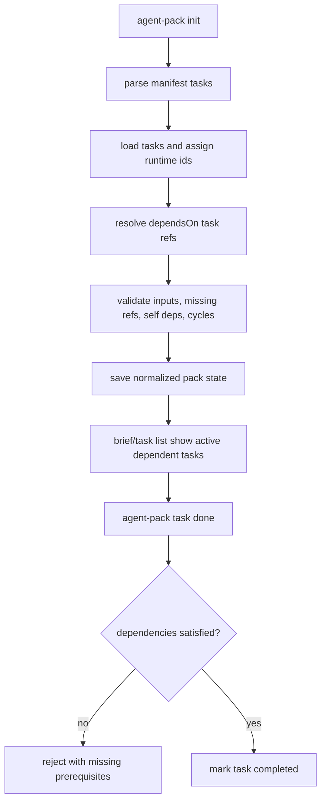

# Agent Pack Task Dependencies

## Overview

Add a manifest-authored `dependsOn` task field that keeps dependent tasks visible and counted as active work, but prevents marking them completed until required task and input prerequisites are satisfied. This is separate from `when`: `when` controls activation and hides locked tasks, while `dependsOn` controls completion eligibility for tasks that should remain part of the normal agent-facing workflow.

## Motivation

Conditional tasks are useful for optional or later-unlocked work, but they are the wrong model for required prerequisite workflows because locked tasks are hidden and do not count toward completion. Agents need a way to see required work up front while being prevented from completing it prematurely.

## Scope

In scope:

- Add one manifest task field, `dependsOn`.
- Support dependencies on authored task ids and declared input names.
- Resolve authored task dependencies to runtime task ids at init.
- Store normalized dependency metadata in pack state.
- Keep dependent tasks visible in default brief and task list output.
- Reject `task done` when dependencies are unsatisfied.
- Render dependency information in brief/task detail/report output.
- Add parser, state, behavior, renderer, smoke, and documentation coverage.

Out of scope:

- Aliases such as `depends`, `requires`, or `blockedBy`.
- Expression languages, OR/negation, or comparison operators.
- Hiding tasks based on dependencies.
- Automatic relocking, uncompletion, or task status downgrades when dependencies later become unsatisfied.
- CLI flags for adding dependencies to ad hoc tasks.
- Interpolation of dependency values into task bodies, references, paths, or instructions.

## Contract

- Manifest field: add one task field, `dependsOn`. No aliases.
- Supported YAML shape:

```yaml
tasks:
  - id: create-branch
    title: Create feature branch
    dependsOn:
      tasks: [resolve-slug]
      inputs: [slug]
```

- `dependsOn.tasks` is optional string or non-empty string array of authored task ids from the composed manifest/task inputs. References resolve at init to runtime task ids. Unknown task ids, duplicate target source ids, self-dependencies, and dependency cycles are init errors.
- `dependsOn.inputs` is optional string or non-empty string array of declared manifest input names. Unknown inputs are init errors. Input dependency satisfaction uses the same exists semantics as `when`: value is present, and strings must be non-empty after trim.
- A `dependsOn` object must contain at least one non-empty dependency list. It is omitted from state when absent.
- Pack state stores normalized runtime dependencies on each task, for example `dependsOn: { tasks: ["t003"], inputs: ["slug"] }`. Work status remains `pending | in_progress | blocked | completed`; activation remains `active | locked`. No new status is introduced.
- Dependency behavior: tasks with unmet dependencies remain active, visible in `brief`, visible in default `task list`, and counted in `taskCounts`. `task start`, `task note`, and `task block` remain allowed. `task done` rejects while dependencies are unsatisfied.
- Successful completion check: all task dependencies have status `completed`; all input dependencies are satisfied by current pack inputs. Already-completed tasks are not automatically downgraded if dependencies later become unsatisfied.
- Relationship with `when`: `when` controls activation and visibility; `dependsOn` controls completion eligibility. A locked task still cannot be shown or mutated until unlocked. Once active, its dependencies are enforced only on completion.
- CLI: no new command or flags for MVP. Existing `agent-pack task done <task-id> --id <pack-id>` exits non-zero with `AgentPackError` on unmet dependencies and prints missing task/input names. JSON report/state output includes `dependsOn`.
- Rendering: task detail and full brief show a concise `Depends on` section for tasks that declare dependencies, including task ids/titles/statuses and input names/current satisfied/missing state. Default task list remains compact and unchanged except dependent tasks are present because they are active.
- Compatibility: hot cut. Existing pack states without `dependsOn` remain valid because the field is optional; unsupported alternative field names are rejected.

## Surface Inventory

| Name | Disposition | Layers | Symmetric Peers | Removal Twin |
|---|---|---|---|---|
| `dependsOn` | Added | Manifest YAML parser/validator; `ManifestTask` and `PackTask` types; task load/init dependency resolver; persisted pack state validation; report JSON; README/docs examples; integration tests. | Existing task fields `id`, `title`, `doneWhen`, `when`. | None. |
| `dependsOn.tasks` | Added | Manifest validation; init-time authored-id to runtime-id resolution; state validation; dependency satisfaction checks; brief/task rendering; tests for unknown/duplicate/self/cycle/incomplete/completed targets. | Task `id`/`sourceId`; runtime task ids `t001`, etc. | None. |
| `dependsOn.inputs` | Added | Manifest validation against `inputSchema`; state validation; dependency satisfaction checks after `agent-pack input set/unset`; brief/task rendering; tests for missing/empty/defaulted inputs. | `inputs` schema, `when` input references, `agent-pack input` commands. | None. |
| `Depends on` section | Added | `renderBrief`, `renderTask`, possibly `renderReport`; unit and integration tests. | Existing `Done when` and `Notes` sections. | None. |
| Unmet dependency error from `agent-pack task done` | Added | Core `updateTask`; CLI error path; smoke/integration tests. | Existing locked-task mutation error and input validation errors. | None. |

## Schema

Before:

```ts
interface ManifestTask {
  id?: string;
  title?: string;
  category?: string;
  body?: string;
  doneWhen?: string[];
  when?: TaskWhen;
  source?: SourceInfo;
}

interface PackTask {
  id: string;
  sourceId?: string;
  title: string;
  category?: string;
  body?: string;
  doneWhen?: string[];
  status: TaskStatus;
  notes: string[];
  source?: SourceInfo;
  activation?: TaskActivation;
  when?: TaskWhen;
  unlockedAt?: string;
  startedAt?: string;
  completedAt?: string;
  blockedAt?: string;
}
```

After:

```ts
interface ManifestTaskDependencies {
  tasks?: string | string[];
  inputs?: string | string[];
}

interface PackTaskDependencies {
  tasks?: string[];
  inputs?: string[];
}

interface ManifestTask {
  id?: string;
  title?: string;
  category?: string;
  body?: string;
  doneWhen?: string[];
  when?: TaskWhen;
  dependsOn?: ManifestTaskDependencies;
  source?: SourceInfo;
}

interface PackTask {
  id: string;
  sourceId?: string;
  title: string;
  category?: string;
  body?: string;
  doneWhen?: string[];
  status: TaskStatus;
  notes: string[];
  source?: SourceInfo;
  activation?: TaskActivation;
  when?: TaskWhen;
  dependsOn?: PackTaskDependencies;
  unlockedAt?: string;
  startedAt?: string;
  completedAt?: string;
  blockedAt?: string;
}
```

Persisted state stores only normalized runtime task ids in `dependsOn.tasks`. Manifest parsing accepts a scalar string for convenience but normalizes to arrays before state write.

## Impact Surface

| File | Responsibility | Existing Tests |
|---|---|---|
| `src/core/types.ts` | Defines `ManifestTask` and `PackTask`; add manifest and normalized dependency types. Preserve separate `status` and `activation` fields. | Typecheck plus integration pack state fixtures. |
| `src/core/manifest/parse.ts` | Add `dependsOn` to known task keys and strict YAML validation. Preserve current `when` validation and unknown-key rejection. | Integration tests for unsupported manifest/task fields and invalid `when`; add parser cases for dependencies. |
| `src/core/tasks/load.ts` | Carries authored `sourceId` and assigns runtime ids. Add or support a post-load resolver that maps `dependsOn.tasks` authored ids to runtime ids. | Integration tests for task id sequencing and manifest task loading. |
| `src/core/operations.ts` | Init flow resolves inputs, loads tasks, initializes activation, and mutates task status. Add dependency resolution before state write and completion enforcement in `updateTask`. | Integration tests around init, input conditions, locked task updates, task add/mutations. |
| `src/core/inputs.ts` | Owns input schema validation and existence semantics used by `when`. Expose or reuse the same input existence rule for input dependencies. | Unit/integration input and conditional task tests. |
| `src/core/state/store.ts` | Validates persisted pack/task fields and recomputes status/counts on save. Add `dependsOn` known field and state validation for task/input references. | Integration tests for invalid pack state and task fields. |
| `src/core/state/status.ts` | Counts only active tasks. Should remain unchanged because dependent tasks stay active. | Integration/smoke tests for task counts. |
| `src/core/brief/render.ts` | Renders brief, task details, report, and summary. Add dependency sections without changing compact task list semantics. | Unit brief render tests. |
| `src/cli/agent-pack.ts` | Wires task commands and status mutations. No new command needed; keep error reporting through core `AgentPackError`. | Smoke tests for task mutation output and CLI failures. |
| `README.md`, `docs/usage.md` | Document manifest task dependencies and distinction from `when`. | Documentation review; smoke examples if added. |
| `test/integration/pack-workflow.test.ts` | Main behavioral coverage for init, state, mutation, rendering, and input changes. | Existing conditional input/task tests provide adjacent coverage. |
| `test/unit/brief-render.test.ts` | Renderer-level dependency display coverage. | Existing brief/task/report render tests. |
| `test/smoke/cli-git-smoke.test.ts` | End-to-end CLI behavior for unmet and then satisfied dependencies. | Existing smoke coverage for task mutations and input workflow. |

## Higher-Level Implementation Steps

- Add dependency types to `src/core/types.ts`.
- Extend manifest parsing with strict `dependsOn` validation and normalization helpers.
- Preserve authored dependency refs through task loading, then resolve them after all tasks are loaded and before `createPack`.
- Add a small dependency module for validation, cycle detection, satisfaction checks, and display models.
- Extend pack state validation to accept normalized `dependsOn` and reject malformed or dangling dependencies.
- Enforce dependency satisfaction in `updateTask` only when transitioning a task to `completed`.
- Render dependency details in brief/task/report output while keeping default task list compact.
- Add README and usage documentation explaining `when` vs `dependsOn`.
- Add integration, unit, smoke, typecheck, and lint coverage.

## Diagrams



## Risks

- Authored task ids are not guaranteed unique today. Dependency targets need deterministic resolution; init should reject ambiguous duplicate source ids used as dependency targets.
- Cycles would make completion impossible or confusing. Detect direct and transitive cycles at init.
- Dependencies on locked conditional tasks can expose a hidden prerequisite in rendering. MVP should allow the state relationship but render only the dependency status needed to explain why completion is blocked; docs should recommend visible prerequisite tasks for required work.
- Input unset/default changes can make an already-completed task's dependency unsatisfied. Do not auto-downgrade completed work; enforce dependencies only when transitioning to completed.
- Status downgrades of prerequisite tasks from completed to `in_progress` or `blocked` can make dependents unsatisfied for future completions. This is acceptable and should be tested.
- State validation must reject persisted dependencies pointing at missing task ids or unknown inputs, and should not silently ignore malformed dependency state.
- Rendering needs enough context to explain blocked completion without bloating every task list row.
- Hot cut: add only `dependsOn`, reject aliases and fallback shapes.

## Test Strategy

- Unit/parser: valid `dependsOn` string/array forms; reject unknown keys, empty arrays, scalar object mistakes, unsupported aliases.
- Integration/init: dependencies resolve authored ids to runtime task ids; unknown task/input refs reject before pack write; duplicate target source ids, self-dependency, and cycles reject.
- Integration/state: persisted `dependsOn` accepts normalized task/input arrays and rejects unknown/malformed references.
- Integration/behavior: dependent task appears in default brief/list and counts while prerequisites are incomplete; `task start`, `note`, and `block` are allowed; `task done` rejects with missing task/input details; completion succeeds after required tasks complete and inputs are set.
- Renderer unit: brief/task output includes `Depends on` with task/input satisfaction and does not hide dependent tasks.
- Smoke: CLI-level unmet dependency error and successful completion after prerequisites.
- Commands: run `npm run lint`, `npm run typecheck`, `npm test`, `npm run test:smoke`, and `npm run check` before merging.

## Open Assumptions

- This feature is data/schema plus CLI behavior, not a new planner workflow.
- `dependsOn` is intentionally distinct from `when`: dependencies must not hide required work.
- Dependencies are authored only in YAML for this MVP.
- Task dependencies refer to authored task ids, not runtime ids supplied by the user.
- Input dependencies use existing input schema and current effective input values.
- There is no compatibility layer for alternate field names or legacy dependency shapes.
